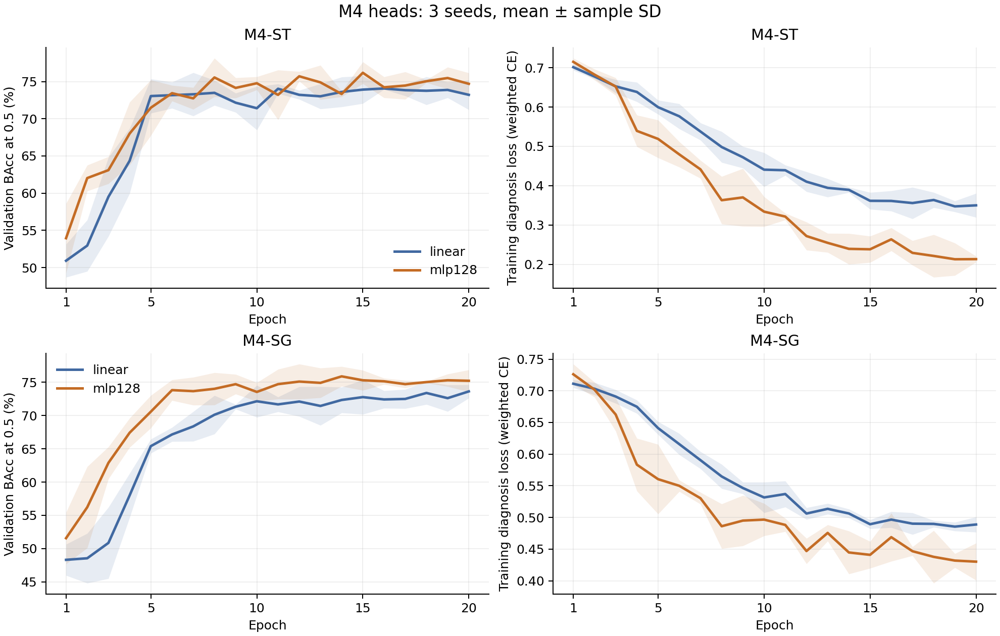

# M4-ST/SG: so sánh diagnosis head

EfficientNet-B0, Derm7pt gốc, official split, 20 epochs, head LR 1e-3 / concept LR 1e-4.
Giữ weighted losses, weight decay 0.01, legacy_letterbox và checkpoint validation BAcc@0.5.
MLP: 28 → 128 → 2, LayerNorm, ReLU, dropout 0.3; Linear: 28 → 2.
SG Linear được đọc từ study LR trước; chín runs còn lại train mới với ba seeds.

| Variant | Head | Validation BAcc mean ± SD | Chọn |
|---|---|---:|---|
| ST | linear | 75.48 ± 0.58 |  |
| ST | mlp128 | 76.65 ± 1.14 | Có |
| SG | linear | 73.95 ± 1.51 |  |
| SG | mlp128 | 76.64 ± 0.95 | Có |

Head được chọn riêng cho ST/SG bằng validation; test dùng threshold validation đã đóng băng.
| Cấu hình | Test Accuracy (%) | Test BAcc (%) | Test Macro F1 | Test AUC |
|---|---:|---:|---:|---:|
| st_linear | 77.806 ± 4.559 | 74.150 ± 2.256 | 0.725 ± 0.030 | 0.819 ± 0.026 |
| st_mlp128 | 78.059 ± 0.814 | 72.586 ± 1.974 | 0.719 ± 0.015 | 0.829 ± 0.010 |
| sg_linear | 73.671 ± 5.231 | 71.589 ± 1.994 | 0.687 ± 0.026 | 0.802 ± 0.014 |
| sg_mlp128 | 76.118 ± 1.483 | 71.499 ± 1.587 | 0.703 ± 0.016 | 0.795 ± 0.028 |

SD là sample SD giữa ba seeds. Accuracy/BAcc SD tính bằng điểm phần trăm.
Heads không được chọn và không phải Linear control chỉ có validation, không có test.
MLP và Linear tiêu thụ RNG khác nhau lúc khởi tạo/dropout: không giả định concept trajectories giống hệt.
Đây là thăm dò sau khi đã biết test baseline cũ và study SG LR; test không tham gia quyết định head lần này.

Nápoles et al. báo cáo raw Derm7pt / EfficientNet-B0 HardCBM Macro F1 0.73 ± 0.03 (5 seeds).
So sánh đúng Macro F1; đây chưa phải tái lập toàn bộ paper vì preprocessing, augmentation, regularization và tiêu chí chọn checkpoint vẫn khác.
Nguồn: https://www.nature.com/articles/s41598-026-56927-2

## Kiểm tra bổ sung

Đã kiểm tra hash, best epoch, threshold validation và hard-vector/head predictions của 12 runs.

| Baseline cũ (10 epochs) | Test Accuracy (%) | Test BAcc (%) | Test Macro F1 | Test AUC |
|---|---:|---:|---:|---:|
| M4-ST | 73.502 ± 3.556 | 66.275 ± 8.379 | 0.647 ± 0.072 | 0.712 ± 0.075 |
| M4-SG | 52.658 ± 23.159 | 52.165 ± 2.792 | 0.426 ± 0.184 | 0.490 ± 0.048 |

Baseline cũ khác training budget và phiên bản PyTorch/Torchvision; chênh lệch chỉ mang tính mô tả.

M4-ST chọn MLP: test BAcc so với Linear -1.56 điểm %, CI 95% [-4.12, +0.95] từ 2.000 paired stratified case bootstraps.

M4-SG chọn MLP: test BAcc so với Linear -0.09 điểm %, CI 95% [-2.77, +2.55] từ 2.000 paired stratified case bootstraps.

| Cấu hình đã đánh giá test | Concept Macro F1 (all defined states) | Mean concept accuracy (%) | Profile exact match (%) |
|---|---:|---:|---:|
| st_linear | 0.507 ± 0.016 | 64.810 ± 1.278 | 6.582 ± 0.253 |
| st_mlp128 | 0.504 ± 0.004 | 63.725 ± 0.540 | 4.557 ± 1.013 |
| sg_linear | 0.519 ± 0.003 | 66.148 ± 0.834 | 6.751 ± 0.585 |
| sg_mlp128 | 0.500 ± 0.023 | 64.521 ± 2.434 | 6.582 ± 0.877 |

Concept Macro F1 là trung bình macro F1 của bảy groups, tính cả mọi state đã định nghĩa.

Bootstrap có điều kiện trên checkpoints, seeds và thresholds cố định; không bao gồm bất định huấn luyện lại.

M4-ST: MLP được chọn bằng validation; so với Linear, test Accuracy +0.25 điểm %, Macro F1 -0.0058. CI BAcc chứa 0, chưa xác lập lợi ích BAcc của MLP trong đợt thử này. Không đổi quyết định head đã đóng băng dựa vào test.

M4-SG: MLP được chọn bằng validation; so với Linear, test Accuracy +2.45 điểm %, Macro F1 +0.0158. CI BAcc chứa 0, chưa xác lập lợi ích BAcc của MLP trong đợt thử này. Không đổi quyết định head đã đóng băng dựa vào test.

Các runs mới là study riêng; chưa đổi defaults hoặc gộp với bộ baseline chính.

