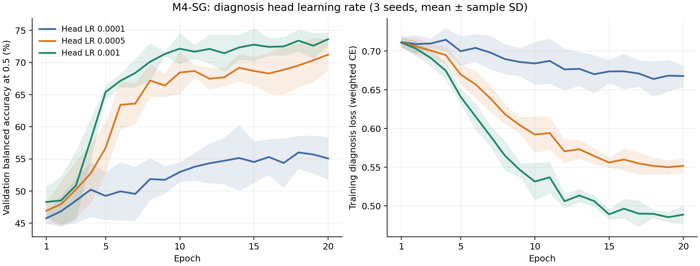

# Thử learning rate riêng cho diagnosis head M4-SG

Giữ EfficientNet-B0, Linear(28, 2), stop-gradient, official split, losses và augmentation.
Ba mức head LR được train 20 epoch với ba seeds; chọn theo mean validation BAcc@0.5.
Đối chứng 20 epoch và cấu hình được chọn mới được đánh giá test sau khi đóng băng lựa chọn.

| Head LR | Validation BAcc mean ± SD |
|---|---:|
| 0.0001 | 57.02% ± 3.60 điểm % |
| 0.0005 | 71.42% ± 2.68 điểm % |
| 0.001 | 73.95% ± 1.51 điểm % |

Head LR được chọn: **0.001**.

| Cấu hình | Test Accuracy | Test BAcc | Test Macro F1 | Test AUC |
|---|---:|---:|---:|---:|
| Cũ: 10 epochs | 52.658 ± 23.159 | 52.165 ± 2.792 | 0.426 ± 0.184 | 0.490 ± 0.048 |
| Đối chứng: 20 epochs | 67.932 ± 2.548 | 61.776 ± 1.866 | 0.608 ± 0.022 | 0.610 ± 0.044 |
| Head LR đã chọn: 20 epochs | 73.671 ± 5.231 | 71.589 ± 1.994 | 0.687 ± 0.026 | 0.802 ± 0.014 |

Accuracy và BAcc tính theo %, SD tương ứng tính bằng điểm phần trăm.
Các JSON summary kèm theo chứa metrics test tính lại từ predictions và SD giữa seeds.
Kết quả cũ dùng môi trường khác; đối chứng 20 epoch mới là đối chứng cùng môi trường.
Đây là đợt tuning thăm dò sau khi đã quan sát kết quả test của cấu hình cũ.

## Kiểm tra bổ sung

Chênh lệch concept loss tối đa giữa ba mức head LR: **0**. Quỹ đạo concept predictor khớp nhau ở cùng seed/epoch; LR riêng chỉ thay cập nhật diagnosis head.

Test BAcc của cấu hình chọn so với đối chứng 20 epochs tăng **9.81 điểm %**. Paired stratified bootstrap 2.000 lần theo case cho CI 95% **[5.72, 13.82] điểm %**. CI có điều kiện trên checkpoints, seeds và thresholds đã cố định; không bao gồm bất định huấn luyện lại.

