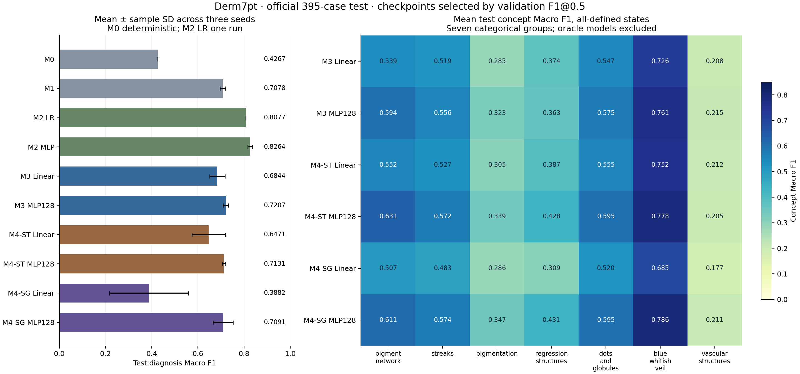
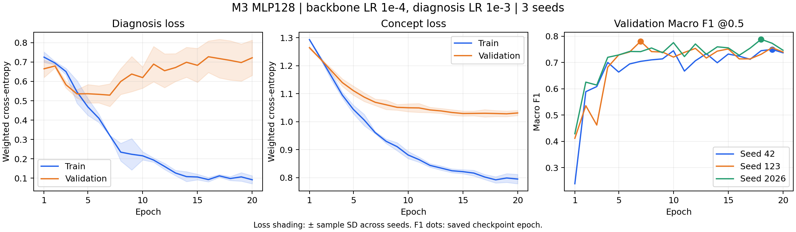
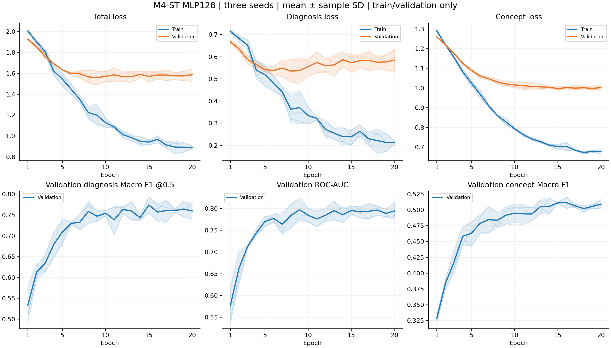
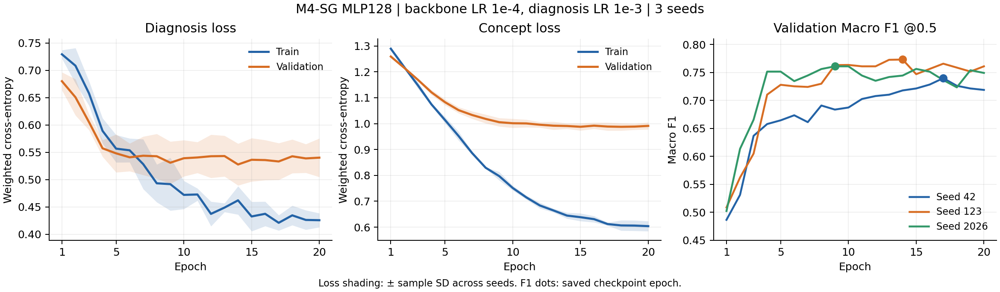
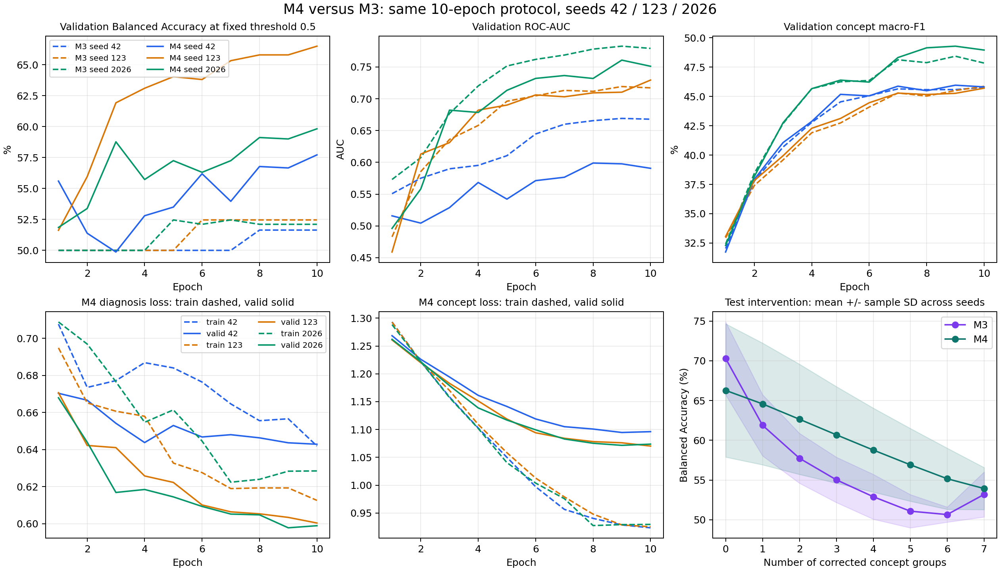

# Tổng hợp, đánh giá và góp ý cải tiến các mô hình

Đọc [bảng kết quả chính và JSON nguồn](../README.md) trước. Bảng test dưới đây chỉ gồm bảy cohort đã chốt. Các phiên bản Linear 10 epochs và bộ BAcc được đặt trong phần lịch sử.

Đi tới: [cấu hình và hướng cải tiến](#baseline-decisions), [M3](#m3-report), [M4-ST](#m4-st-report), [M4-SG](#m4-sg-report), [F1 ban đầu](#legacy-f1), [BAcc cũ](#legacy-bacc), [intervention](interventions_comparison.md).

[Bản chốt baseline và thứ tự cải tiến](#baseline-decisions): giữ M0–M4 hiện tại làm đối chứng; intervention ST/SG đã hoàn tất, chuyển sang M5. Các ablations bổ sung có điều kiện theo validation và ngân sách.

Cập nhật ngày **06/10/2026**, đã có frozen test và intervention M4-ST/SG đủ ba seeds: giữ M0/M1/M2 làm đối chứng, M3 MLP128 làm Soft CBM, M4-SG và M4-ST MLP128 làm Hard CBM đối chứng. Baseline đã đủ để triển khai M5; các thử nghiệm thêm nên nhắm vào concept learning và correction, thay vì tăng đồng loạt epoch/backbone. Đề cương và báo cáo Word được đồng bộ với bộ chính F1 và quy tắc threshold BAcc; số liệu và weights giữ nguyên. Các đề xuất dưới đây được tách rõ với những cải thiện đã đo được. Bảng checkpoint BAcc cũ giữ riêng ở phần lưu trữ/ablation; bảng dưới đây là bảng chính F1.

Bảng sử dụng **kết quả test trên 395 ca của bộ checkpoint chọn theo Macro F1**, kèm M0 majority dùng chung. Các cấu hình có ba seeds 42/123/2026 được báo cáo bằng **mean ± sample SD (ddof=1)**; M0 là baseline xác định, M2 LR có một run nên không có SD. Cột epoch là ngân sách tối đa, không phải epoch checkpoint được chọn. SD của Accuracy/BAcc có đơn vị điểm phần trăm. Dấu — ở concept F1 nghĩa là mô hình không dự đoán concept.

M3 MLP128 20 epochs đã hoàn tất pilot và frozen test ba seeds: [báo cáo train/validation/test](#m3-report). Mean validation F1@0.5 là 0.7727 ± 0.0204; mean test F1 là 0.7207 ± 0.0110. Weights, best epochs, thresholds và validation giữ nguyên từ quyết định trước test.

M4-ST MLP128 20 epochs mới đã hoàn tất pilot và frozen test ba seeds: mean validation F1@0.5 **0.7775 ± 0.0190**, mean test F1 **0.7131 ± 0.0071**, test concept F1 **0.5069 ± 0.0015**. Frozen best epochs **18/15/19**, weights/thresholds và toàn bộ validation giữ nguyên; JSON validation trước test tái tạo đúng SHA-256. [Báo cáo train/validation/test và đối chiếu](#m4-st-report).

| Mô hình | Epoch | Accuracy (%) | BAcc (%) | Macro F1 | ROC-AUC | Concept Macro F1 |
|---|---:|---:|---:|---:|---:|---:|
| M0 — Majority | — | 74.43 | 50.00 | 0.4267 | 0.5000 | — |
| M1 — Black-box | 10 | 77.89 ± 0.53 | 70.74 ± 1.88 | 0.7078 ± 0.0118 | 0.8302 ± 0.0062 | — |
| M2 — Oracle LR | Grid C | 83.54 | 85.37 | 0.8077 | 0.9211 | — |
| M2 — Oracle MLP | 100 | 85.57 ± 1.01 | 86.08 ± 1.50 | 0.8264 ± 0.0107 | 0.9246 ± 0.0030 | — |
| **M3 mới — Soft CBM, MLP128** | 20 | 75.95 ± 0.67 | 75.94 ± 2.07 | 0.7207 ± 0.0110 | 0.8490 ± 0.0173 | 0.4839 ± 0.0122 |
| **M4-ST mới — Hard CBM, MLP128** | 20 | 77.05 ± 0.96 | 72.66 ± 2.09 | 0.7131 ± 0.0071 | 0.8302 ± 0.0092 | 0.5069 ± 0.0015 |
| **M4-SG mới — Hard CBM, MLP128** | 20 | 76.20 ± 4.73 | 72.53 ± 3.12 | 0.7091 ± 0.0437 | 0.8001 ± 0.0258 | 0.5078 ± 0.0155 |

Concept Macro F1 là trung bình qua bảy concept, tính trên toàn bộ trạng thái đã định nghĩa của từng concept (`all-defined`). Không dùng concept ground truth của M2 để coi như một kết quả dự đoán concept hoàn hảo.

Checkpoint được chọn theo **validation diagnosis Macro F1@0.5**; ngưỡng được chọn riêng bằng **validation BAcc**, rồi đóng băng cho test. Vì vậy bộ F1 không có nghĩa ngưỡng cũng tối ưu theo F1. Bảng là đối chiếu kết quả quan sát; M3/M4-SG mới khác các cohort cũ về head, LR head và ngân sách. M3 mới và M4-SG mới cùng head/LRs/ngân sách nhưng khác cả soft/hard representation và luồng gradient, nên chưa xác định hiệu quả riêng từng cơ chế hoặc ST/SG. SD giữa seeds không phải khoảng tin cậy hoặc kiểm định chênh lệch giữa mô hình.

**Validation dùng để chọn cấu hình, cập nhật ngày 05/10/2026.**

| Cohort | Validation F1@0.5 | Validation F1 tại ngưỡng BAcc | Validation concept F1 |
|---|---:|---:|---:|
| M1 | 0.7569 ± 0.0196 | 0.7595 ± 0.0172 | — |
| M2 LR | 0.8379 | 0.8379 | — |
| M2 MLP | 0.8585 ± 0.0049 | 0.8619 ± 0.0079 | — |
| M3 Linear | 0.4566 ± 0.0094 | 0.7071 ± 0.0164 | 0.4530 ± 0.0110 |
| M3 MLP128 | 0.7727 ± 0.0204 | 0.7689 ± 0.0150 | 0.4786 ± 0.0156 |
| M4-ST Linear | 0.6199 ± 0.0552 | 0.6899 ± 0.0603 | 0.4682 ± 0.0185 |
| **M4-ST MLP128 mới** | **0.7775 ± 0.0190** | **0.7865 ± 0.0309** | **0.5033 ± 0.0078** |
| M4-SG Linear | 0.5023 ± 0.0355 | 0.4211 ± 0.1851 | 0.4209 ± 0.0768 |
| M4-SG MLP128 | 0.7579 ± 0.0168 | 0.7601 ± 0.0196 | 0.5194 ± 0.0076 |

Khi nhận xét khoảng cách validation/test, dùng **cùng ngưỡng đã đóng băng**: M1 0.7595 → 0.7078, M3 mới 0.7689 → 0.7207, ST mới 0.7865 → 0.7131, SG mới 0.7601 → 0.7091. Không đối chiếu validation @0.5 với test tại ngưỡng khác rồi diễn giải như độ tổng quát hóa. ST mới có validation cao nhất trong các cohort nhận ảnh này nhưng mean test F1 không cao nhất.

**Chênh lệch test giữa các mô hình nhận ảnh hiện tại.**

Đã tính lại 2.000 paired stratified case bootstraps, seed lấy mẫu 20261005. Mỗi lần giữ 294 ca lớp 0 và 101 ca lớp 1, lấy mẫu có hoàn lại trong từng lớp; cùng ca lấy mẫu cho mọi model/seed. Tính Macro F1 riêng từng trained seed rồi lấy mean, không ensemble predictions.

| So sánh | Delta mean test F1 | Khoảng percentile 95% theo ca |
|---|---:|---:|
| M3 MLP128 − M1 | +0.0129 | [-0.0259, +0.0527] |
| M4-SG MLP128 − M1 | +0.0013 | [-0.0361, +0.0382] |
| M3 MLP128 − M4-SG MLP128 | +0.0116 | [-0.0245, +0.0479] |
| M4-ST MLP128 − M1 | +0.0053 | [-0.0274, +0.0388] |
| M4-ST MLP128 − M3 MLP128 | -0.0076 | [-0.0344, +0.0192] |
| M4-ST MLP128 − M4-SG MLP128 | +0.0040 | [-0.0246, +0.0325] |

Cả sáu khoảng đều chứa 0: hiện chưa xác lập ưu thế F1 của một mô hình nhận ảnh trong bốn cấu hình này. Khoảng trên có điều kiện theo weights/seeds/thresholds cố định; giả định độc lập giữa cases, không bao gồm bất định huấn luyện lại hoặc cụm bệnh nhân. Chỉ có ba trained seeds và test đã được tham khảo trong các đợt follow-up, nên không mô tả đây là kết quả xác nhận trên holdout hoàn toàn mới. Không chọn lại model/seed/ngưỡng theo bootstrap test.



**1. M0 — Majority: mốc kiểm tra tác động của mất cân bằng lớp.**

M0 luôn dự đoán lớp không melanoma: đúng 294/395 ca nên Accuracy vẫn đạt 74,43%, nhưng bỏ sót toàn bộ 101 ca melanoma. BAcc 50%, sensitivity 0% và AUC 0,5 cho thấy không có khả năng phân biệt hai lớp. Đây là lý do không đánh giá khóa luận chỉ bằng Accuracy. Giữ M0 làm mốc cơ bản; không cần train lại.

**2. M1 — Black-box EfficientNet-B0: baseline nhận ảnh ổn định.**

Macro F1 0,7078 ± 0,0118 và AUC 0,8302 ± 0,0062 cho thấy kết quả ổn định qua ba seeds. Trong các mô hình nhận ảnh đã chạy, M1 có mean Accuracy cao nhất; M3 MLP128 mới có mean AUC cao hơn (0,8490). Điểm yếu là sensitivity melanoma chỉ 56,11%, trong khi specificity 85,37%; mô hình còn bỏ sót nhiều ca dương tính ở ngưỡng đã chọn.

Train loss trung bình giảm 0,674 → 0,253, train BAcc cuối lịch khoảng 91,55%, nhưng validation loss cuối lịch khoảng 0,530. Validation F1 tốt nhất ở epochs 7/7/8 và giảm ở epoch 10 của cả ba seeds: lợi ích validation đã chững lại, có dấu hiệu overfitting. Các số train được ghi khi cập nhật weights và có augmentation, không phải lượt train-eval riêng. Giữ ba checkpoint hiện tại làm baseline; chưa có căn cứ bắt buộc tăng epoch.

**3. M2 — Oracle Logistic Regression: bằng chứng concept ground truth chứa tín hiệu chẩn đoán mạnh.**

Chỉ nhận concept ground truth, LR đạt Macro F1 0,8077, BAcc 85,37%, AUC 0,9211 và sensitivity 89,11%. Kết quả cao hơn các mô hình nhận ảnh hiện tại gợi ý rằng bộ concept có nhiều thông tin liên quan đến diagnosis; pipeline dự đoán concept rồi chẩn đoán chưa khai thác được mức hiệu năng này.

C=0,1 được chọn trên validation; không có lịch epoch như mạng nhận ảnh. Đây là oracle reference, không phải hệ thống tự dự đoán concept từ ảnh và không phải cận trên tuyệt đối của mọi model. Chỉ có một run nên không suy ra độ ổn định qua seeds. Giữ làm đối chứng tuyến tính; không cần train lại chỉ để đạt ngân sách 20 epochs.

**4. M2 — Oracle MLP: kết quả chẩn đoán tốt nhất quan sát trong bảng.**

Macro F1 0,8264 ± 0,0107, BAcc 86,08% ± 1,50 điểm % và AUC 0,9246 ± 0,0030 đều cao, tương đối ổn định. Sensitivity 87,13% và specificity 85,03% cho thấy cân bằng hai lớp tốt hơn M1 và các CBM nhận ảnh hiện tại. MLP có mean F1 cao hơn LR, nhưng bảng này chưa kiểm định để kết luận khác biệt có ý nghĩa.

Ngân sách 100 epochs; checkpoint tốt nhất ở 66/48/95. Đây là MLP nhỏ nhận 28 chiều concept ground truth, nên số epoch không thể dùng trực tiếp để so chi phí huấn luyện với backbone ảnh. History hiện chỉ lưu BAcc/F1 validation, không có train loss để đánh giá chi tiết overfitting của M2 MLP. Giữ làm đối chứng phi tuyến về khả năng chẩn đoán từ concept đúng.

**5. M3 — Soft Joint CBM: MLP128 cải thiện diagnosis so với cấu hình Linear ban đầu.**

Cohort Linear 10 epochs ban đầu đạt test Macro F1 0,6844 ± 0,0326, AUC 0,7616 ± 0,0446, sensitivity 62,38%, specificity 78,23%. Accuracy 74,18% gần M0 74,43%, song BAcc 70,30% và F1 tốt hơn majority rõ ràng. Train diagnosis loss chỉ giảm 0,695 → 0,656; validation F1@0.5 ở các checkpoint chỉ 0,4457/0,4621/0,4621, nên cấu hình này chưa học diagnosis hiệu quả.

Cohort mới MLP128/head LR 1e-3/20 epochs đạt test Macro F1 **0,7207 ± 0,0110**, BAcc **75,94% ± 2,07 điểm %**, AUC **0,8490 ± 0,0173**. Cả ba seeds tăng F1 so với Linear, riêng seed 2026 chỉ tăng khoảng 0,0003. Mean F1/BAcc/AUC cao nhất trong các mô hình nhận ảnh ở bảng này, nhưng chưa có kiểm định khẳng định ưu thế. So với M1, sensitivity cao hơn (75,91% so với 56,11%), specificity thấp hơn (75,96% so với 85,37%) và Accuracy thấp hơn. So với M4-SG mới, mean F1/AUC cao hơn quan sát, còn concept F1 thấp hơn (0,4839 so với 0,5078).

Train diagnosis loss mới giảm 0,725 → 0,092; concept loss 1,293 → 0,795. Train BAcc cuối lịch khoảng 96,38%, trong khi diagnosis validation loss khoảng 0,722; validation F1 cuối lịch thấp hơn đỉnh ở cả ba seeds. Có dấu hiệu overfitting, đặc biệt diagnosis; không quy toàn bộ gap loss cho overfitting vì hai lượt khác chế độ/dữ liệu. Mean validation F1 tại thresholds đã chốt 0,7689, test 0,7207. Giữ checkpoints epochs 19/7/18 và thresholds đã chọn bằng validation; không tăng epoch hoặc điều chỉnh ngưỡng theo test.

Concept F1 0,4839 tăng vừa phải so với Linear 0,4570, nhưng exact match toàn bộ bảy groups khoảng 3,54%, thấp hơn mốc cũ 4,22%. Pigmentation/vascular structures còn yếu; diagnosis tốt hơn chưa tự chứng minh chất lượng explanation hoặc concept leakage. Intervention đã hoàn tất 128 subsets mỗi seed: sửa đủ bảy groups làm mean F1 **0,7207 → 0,6677**, BAcc **75,94% → 74,53%**. Seed 123 giảm mạnh, seed 2026 tăng; lợi ích correction chưa ổn định. Giữ cohort mới làm Soft CBM đối chứng và báo cáo intervention riêng với bảng test tự động. Head/LR/ngân sách cùng thay đổi nên không tách đóng góp riêng; đối chiếu soft/hard hiện còn khác cơ chế gradient. [Báo cáo M3 mới](#m3-report) · [Phân tích intervention](interventions_comparison.md#m3-analysis).

**6. M4-ST — Hard CBM Linear, 10 epochs: kết quả nhạy với seed và cần kiểm tra ngân sách.**

Test Macro F1 0,6471 ± 0,0722 và BAcc 66,28% ± 8,38 điểm % cho thấy dao động lớn. Seed 42 có sensitivity 22,77%, trong khi seeds 123/2026 đạt 60,40%/71,29%. Do đó chỉ nhìn mean Accuracy 73,50% sẽ bỏ qua sự không ổn định của khả năng phát hiện melanoma.

Train diagnosis loss giảm 0,704 → 0,628, concept loss giảm 1,291 → 0,926; cả ba seeds đều chọn checkpoint epoch 10, là cuối ngân sách. Đây là căn cứ để khảo sát lịch train dài hơn bằng validation, không bảo đảm tăng epoch sẽ tăng test. Concept F1 0,4700 nhỉnh hơn M3 quan sát nhưng diagnosis thấp hơn: concept metrics tốt hơn không tự động làm diagnosis tốt hơn. ST MLP128/head LR 1e-3/backbone LR 1e-4/20 epochs đã hoàn tất pilot và test mới: validation F1@0.5 **0,7775 ± 0,0190**, test **0,7131 ± 0,0071**. PyTorch ST mới 2.12 khác 2.14 của SG trước, nên chưa coi đây là đối chiếu cô lập hoàn toàn gradient ST/SG.

**6b. M4-ST mới — MLP128, 20 epochs: frozen test ổn định về F1, sensitivity còn biến động.**

Validation F1@0.5 **0.7775 ± 0.0190** tăng rõ so với Linear cũ **0.6199 ± 0.0552**; best epochs **18/15/19** và thresholds **0.323596/0.427888/0.433949** đã đóng băng. Frozen test F1 **0.7131 ± 0.0071**, BAcc **72.66% ± 2.09 điểm %**, AUC **0.8302 ± 0.0092**, concept F1 **0.5069 ± 0.0015**. F1/SD tốt hơn cấu hình ST Linear cũ quan sát, nhưng head/LR/ngân sách cùng đổi nên chưa tách hiệu quả riêng.

Mean sensitivity **63.70% ± 8.00 điểm %**, range **56.44–72.28%**; seed 123 bỏ sót 44/101 melanoma. Do đó SD F1 nhỏ không đồng nghĩa sensitivity ổn định. Concept F1 gần SG mới (0.5078), cao hơn M3 mới (0.4839), exact match chỉ **4.14%**. Ba paired bootstrap ST−M1/M3/SG đều chứa 0: chưa có bằng chứng ST vượt các models này về F1.

Train diagnosis loss giảm 0.715 → 0.213, còn validation diagnosis loss epoch 20 khoảng 0.584; concept loss train/validation cuối lịch 0.677/1.002. F1 epoch 20 thấp hơn best ở cả ba seeds: có dấu hiệu overfitting, giữ best checkpoints và ngân sách 20 epochs. Mean F1 ở cùng frozen thresholds giảm validation **0.7865 → test 0.7131**. Cả ba checkpoint hashes khớp, toàn bộ JSON validation trước test tái tạo đúng SHA-256. Intervention đã hoàn tất: full correction tăng mean F1 **0.7131 → 0.7862**, nhưng mean sensitivity **63.70% → 63.04%**, specificity **81.63% → 91.84%**. F1 tăng ở cả ba seeds; vẫn có ca/subset giảm. Khác phiên bản PyTorch so với SG trước cần được ghi trong phép so sánh. [Báo cáo ST mới](#m4-st-report) · [Intervention chung](interventions_comparison.md).

**7. M4-SG cũ — Hard CBM Linear, 10 epochs: một cấu hình học diagnosis không hiệu quả.**

AUC test 0,4903 ± 0,0477 gần 0,5, BAcc 53,57% và Macro F1 0,3882 cho thấy diagnosis rất yếu. Train diagnosis loss gần như không giảm (0,716 → 0,702), dù concept loss giảm 1,290 → 0,909. Vì vậy tổng loss giảm ở đây chủ yếu phản ánh việc học concept; không đủ để nói cả model đang học diagnosis tốt.

Threshold tối ưu theo BAcc validation còn làm giảm F1: seed 42 giảm từ validation F1@0.5 0,4830 xuống 0,2389 và ở test dự đoán melanoma cho 392/395 ca. Đổi ngưỡng không sửa được khả năng xếp hạng yếu vốn thể hiện qua AUC. Đây là quy tắc chọn ngưỡng khác metric checkpoint, không phải bằng chứng test gây ra lựa chọn. [Tài liệu scikit-learn về decision threshold](https://scikit-learn.org/stable/modules/classification_threshold.html).

Best epochs 1/5/4 khiến concept test được đo ở các checkpoint khá sớm, đặc biệt seed 42. Không diễn giải concept F1 0,4239 là giới hạn của SG ở toàn bộ lịch 10 epochs. Giữ cohort này làm đối chứng cấu hình ban đầu; không dùng kết quả này để khẳng định stop-gradient hoặc Hard CBM nói chung kém.

**8. M4-SG mới — MLP128, LR head 1e-3, 20 epochs: đối chứng Hard CBM có ý nghĩa hơn.**

Macro F1 0,7091 ± 0,0437 cải thiện lớn so với SG cũ; AUC tăng lên 0,8001. Cả hai nhánh học rõ: train diagnosis loss 0,729 → 0,426, concept loss 1,289 → 0,604. Đây là thay đổi đồng thời head/LR/ngân sách, nên chưa xác định đóng góp riêng của từng thay đổi.

Mean F1 gần M1 (0,7091 so với 0,7078), sensitivity cao hơn (65,02% so với 56,11%) nhưng specificity thấp hơn (80,05% so với 85,37%), Accuracy và AUC cũng thấp hơn. Đó là sự đánh đổi quan sát tại các thresholds đã đóng băng; chưa có cơ sở kết luận vượt M1. Seed 123 test F1 0,7570, seed 2026 chỉ 0,6716; phải giữ cả ba seeds trong báo cáo.

Concept F1 0,5078 cao nhất trong các CBM nhận ảnh đã chạy; concept Accuracy 64,80% và exact match khoảng 5,91%. Tuy nhiên chất lượng khác nhau rõ giữa concepts: blue-whitish veil F1 khoảng 0,7864, pigmentation 0,3465, vascular structures 0,2107. Train có trạng thái pigmentation không có mẫu và nhiều trạng thái vascular rất ít mẫu; đây là hạn chế dữ liệu cần nêu khi diễn giải, không phải lý do bỏ các lớp khỏi bảng chính.

Best epochs 17/14/9; F1 validation cuối lịch thấp hơn đỉnh ở cả ba seeds. Mean F1 validation ở ngưỡng đã chọn là 0,7601, test 0,7091: có khoảng cách tổng quát hóa. Ở epoch 20 concept loss train/validation khoảng 0,604/0,991, diagnosis khoảng 0,426/0,540. Xu hướng validation chững lại có thể kèm overfitting nhẹ; không quy toàn bộ gap loss cho overfitting vì train/validation khác chế độ đánh giá. Giữ cohort đã chốt, chưa có căn cứ tăng lên 30–40 epochs chỉ vì train loss còn giảm.

SG intervention mới đã hoàn tất: full correction tăng F1 cả ba seeds, mean **0.7091 → 0.8212 ± 0.0228**, BAcc **72.53% → 83.43%**, sensitivity **65.02% → 78.55%**, specificity **80.05% → 88.32%**. SG có full-intervention F1 cao nhất quan sát trong ba MLP128 CBMs, nhưng đây là kết quả có GT concepts, không phải automatic test hoặc ưu thế đã kiểm định. [SG intervention](interventions_comparison.md#m4-sg-details).

**Những bằng chứng bổ sung làm thay đổi ưu tiên cải tiến.**

1. **LR head có bằng chứng riêng; MLP lớn hơn chưa có lợi ích test chắc chắn.** Study BAcc giữ SG Linear, cùng môi trường và 20 epochs: tăng head LR 1e-4 → 1e-3 làm validation BAcc 57.02% → 73.95%, test F1 0.6077 → 0.6868. Study head cùng LR/ngân sách lại cho ST Linear test F1 **0.7250**, ST MLP **0.7193**; SG Linear **0.6868**, SG MLP **0.7026**. MLP được chọn đúng từ validation, nhưng không luôn hơn Linear trên test. Những runs BAcc này khác checkpoints F1 ở bảng chính, không gộp mean hoặc dùng điểm 0.7250 để thay lựa chọn ST mới. [Study LR](../bacc/ablation/m4_sg_head_lr_study/report.md) · [Study head](../bacc/ablation/m4_head_comparison/report.md).
2. **Ngân sách và cách kiểm soát overfitting cần được nhìn theo history.** M3/M4-ST/SG mới đều có best F1 cao hơn epoch 20. Giữ best checkpoints đã giải quyết việc lấy nhầm weights cuối lịch. Early stopping chủ yếu tiết kiệm compute; không tự tăng khả năng tổng quát hóa. Patience quá ngắn có thể bỏ đỉnh muộn: M3 seed 42 đạt 0.7444 ở epoch 10 rồi tăng lên 0.7495 ở epoch 19; patience 5 theo F1 sẽ dừng trước đỉnh này. Chưa có căn cứ tăng ngân sách đồng loạt lên 40–100 epochs.
3. **Prediction quality và confidence quality là hai mặt cần đo riêng.** Từ probabilities test đã lưu, tính Brier `mean((p-y)^2)` và binary NLL không weighting, clip probabilities vào [1e-7, 1−1e-7]. Không fit calibration trong lượt review này.

| Model nhận ảnh | Raw test Brier ↓ | Raw test NLL ↓ |
|---|---:|---:|
| M1 | 0.1421 ± 0.0033 | 0.4356 ± 0.0060 |
| M3 MLP128 | 0.1498 ± 0.0116 | 0.5021 ± 0.0828 |
| M4-ST MLP128 | 0.1551 ± 0.0067 | 0.4942 ± 0.0342 |
| M4-SG MLP128 | 0.1624 ± 0.0220 | 0.4922 ± 0.0539 |

M3 có F1/AUC cao hơn quan sát nhưng raw Brier/NLL chưa tốt hơn M1. Brier/NLL còn phụ thuộc khả năng phân biệt lớp, nên đây chưa phải bằng chứng riêng về calibration. Đề xuất đo reliability diagram và thử temperature scaling hoặc Platt scaling bằng validation trong một protocol mới. Calibration cần được chốt trước test; không tự bảo đảm F1 tăng, và một phép temperature scaling đơn điệu không cải thiện thứ tự xếp hạng/AUC. [Guo et al., ICML 2017](https://proceedings.mlr.press/v70/guo17a.html).

Checkpoint theo F1@0.5 và threshold theo BAcc là hai quyết định đang được khai báo rõ. Giữ quy tắc này khi hoàn tất các baselines/M5 cùng benchmark. Nếu chọn một protocol mới theo Macro F1 cả ở checkpoint lẫn threshold, phải áp dụng nhất quán trên validation, lưu cohort riêng và báo cáo mức test exposure trước đó. Ngưỡng thấp tự nó không chứng minh lỗi; lựa chọn threshold phục vụ một mục tiêu khác lựa chọn ranking model. [scikit-learn: decision thresholds](https://scikit-learn.org/stable/modules/classification_threshold.html).

**Concept predictor: nơi nên đầu tư trước khi đổi backbone.**

| Concept | Test F1 M3 MLP128 | Test F1 SG MLP128 | Nhận xét |
|---|---:|---:|---|
| pigment_network | 0.5944 | 0.6107 | Khá hơn các groups hiếm, vẫn còn nhiều lỗi |
| streaks | 0.5558 | 0.5741 | Còn khoảng trống cải thiện |
| pigmentation | 0.3230 | 0.3465 | Yếu; một state không có trong train/validation |
| regression_structures | 0.3630 | 0.4311 | SG cao hơn quan sát; cần xem nhầm từng state |
| dots_and_globules | 0.5750 | 0.5953 | Mức trung bình |
| blue_whitish_veil | 0.7608 | 0.7864 | Group học tốt nhất hiện tại |
| vascular_structures | 0.2155 | 0.2107 | Yếu nhất, cả hai model đều cần cải thiện |

Train chỉ có **413 ca**, gồm **323 non-melanoma và 90 melanoma**. `pigmentation/localized regular` có **0 train, 0 validation, 3 test**. Vascular có các states chỉ **1/4/5 mẫu train**; balanced state weight lớn nhất là **51.625** cho state chỉ có một mẫu. Augmentation từ các states đã quan sát không cung cấp supervision thật cho một state hoàn toàn vắng mặt.

Giữ all-defined Macro F1 làm metric chính đã chốt, đồng thời đọc per-state support/confusion và train-observed F1. Các states không có support ở một split vẫn đóng góp F1=0 theo định nghĩa hiện tại; chẳng hạn vascular `wreath` có một mẫu train nhưng không có mẫu test. Không xóa state hoặc gộp state sau khi đọc test để tăng điểm. Nếu bổ sung dữ liệu train đã được chuyên gia xác nhận hoặc thay taxonomy, phải là một cohort/benchmark mở rộng riêng.

Train có **18/176 GT concept profiles** xuất hiện ở cả hai lớp diagnosis, chứa **76 ca**. Đây là chồng lấp nhãn khi chỉ nhìn bảy concepts, không tự chứng minh annotation sai. Không loại các ca này dựa trên cờ inconsistency được tính từ toàn dataset. M2 là oracle reference có giá trị, nhưng GT concepts không xác định diagnosis hoàn hảo cho mọi ca và kết quả M2 không phải cận trên tuyệt đối của model nhận ảnh.

**Góp ý cụ thể theo mô hình.**

| Model/cohort | Quyết định hiện tại | Cải tiến có mục tiêu nếu cần thử thêm |
|---|---|---|
| M0 | Giữ baseline xác định | Không cần train/tune |
| M1 | Giữ baseline nhận ảnh ổn định | Đo calibration và sensitivity/specificity; nếu thử preprocessing, chọn bằng validation và giữ B0/epochs/LRs để đọc được tác động riêng |
| M2 LR | Giữ oracle tuyến tính | Giữ C đã chọn; tăng epoch hoặc đổi backbone không áp dụng cho LR |
| M2 MLP | Giữ oracle phi tuyến | Bổ sung logging train/validation loss cho runs tương lai; chỉ thử regularization nếu history mới cho thấy cần, không retrain chỉ để bằng epoch backbone |
| M3 Linear | Giữ mốc cấu hình ban đầu | Đã có MLP follow-up, không tiếp tục tối ưu lại cohort cũ |
| M3 MLP128 | Giữ Soft CBM chính và intervention âm/không ổn định | Ablation head LR 5e-4 so với 1e-3; một ablation riêng lambda concept 2 so với 1; chấm cả diagnosis, concept và intervention trên validation |
| M4-ST Linear | Giữ mốc hard/ST ban đầu | Cohort MLP128 đã có frozen test đủ ba seeds; không cần tối ưu lại cohort cũ |
| M4-ST MLP128 | Giữ Hard CBM ST đối chứng; F1 ổn định, full correction tăng F1 | Đã đủ intervention ba seeds; đọc các ca đúng → sai và sensitivity, chưa cần train thêm |
| M4-SG Linear | Giữ đối chứng học diagnosis yếu ở cấu hình ban đầu | Study LR đã chỉ ra hướng xử lý; không dùng cohort này để kết luận SG nói chung kém |
| M4-SG MLP128 | Giữ Hard CBM SG đối chứng; full correction tăng F1 ở cả ba seeds | Đã đủ intervention; nếu cần nâng concept, thử smoothing/capping state weights như một ablation riêng, đọc per-state outcomes |
| M5 categorical ECBM | Chưa có code/kết quả model | Ưu tiên triển khai và ablation năng lượng, đo propagation và chi phí inference |

Các LR/lambda/weighting đề xuất là **giả thuyết cần kiểm chứng**, không phải cấu hình tối ưu đã xác nhận. Mỗi ablation giữ những knobs khác cố định, lưu tên/config riêng, xem pilot validation rồi xác nhận đủ ba seeds. Preprocessing đã có preset `comparison`; cần đối chiếu ảnh để bảo đảm crop vẫn giữ vùng tổn thương và biến đổi màu không làm mất ý nghĩa của concept màu. Chưa có kết quả validation cho preset này để chọn thay `legacy_letterbox`.

**Intervention: ưu tiên chất lượng correction, không chỉ điểm diagnosis tự động.**

Đã có đủ 128 subsets × 395 ca × ba seeds cho M3/ST/SG MLP128. Giữ weights/thresholds và automatic test nguyên trạng. [Báo cáo và curves chung](interventions_comparison.md).

| Cohort | Automatic test F1 | Full GT intervention F1 | Delta mean F1 |
|---|---:|---:|---:|
| M3 MLP128 | 0.7207 ± 0.0110 | 0.6677 ± 0.1296 | -0.0530 |
| M4-ST MLP128 | 0.7131 ± 0.0071 | 0.7862 ± 0.0279 | +0.0731 |
| M4-SG MLP128 | 0.7091 ± 0.0437 | 0.8212 ± 0.0228 | +0.1121 |

ST/SG tăng full F1 ở cả ba seeds, nhưng mỗi model vẫn có mean 26 ca diagnosis đúng → sai khi sửa đủ concepts. ST mean F1 tại m=6 (0.7900) cao hơn m=7 (0.7862); SG curve mean tăng qua các m nhưng một số subsets vẫn giảm so với baseline. Không dùng test để chọn subset/m tốt nhất làm chính sách. Chưa kiểm định chênh lệch intervention giữa models; representation/gradient/runtime vẫn khác nhau. Audit độc lập tái tạo đúng 768 subsets mới và xác minh 147 artifacts cũ giữ nguyên hashes.

M3 MLP128 full intervention làm mean F1 **0.7207 → 0.6677**; seed 123 giảm mạnh, seed 2026 tăng. Soft → GT one-hot và cách head học từ predicted concepts là các giả thuyết giải thích, chưa phải nguyên nhân đã chứng minh. Giữ nguyên measurement này trong khóa luận.

Một thử nghiệm có mục tiêu là **huấn luyện có mô phỏng correction trên train**: chọn ngẫu nhiên một số groups, thay chúng bằng GT one-hot từ ca train, giữ groups còn lại là predicted soft probabilities, vẫn giữ concept loss. Head được thấy cả predicted và corrected inputs. Không sửa annotation, không dùng GT test để train; chọn tỷ lệ correction trên validation. Đây là đề xuất ablation nhằm kiểm tra mismatch, chưa bảo đảm sửa đủ concepts luôn giúp diagnosis.

Các curves hiện tại dùng đầy đủ 128 subsets theo số groups sửa, có giá trị làm baseline. Nếu bổ sung chính sách thực tế, chọn groups theo confidence/uncertainty từ prediction và chốt trên validation; không lấy subset có diagnosis test tốt nhất làm chính sách của model. Chiến lược và đơn vị intervention ảnh hưởng lớn đến kết quả; phải giữ cùng đơn vị là **categorical group** khi so các models. [Shin et al., ICML 2023](https://proceedings.mlr.press/v202/shin23a.html).

M3/M4 giữ nguyên các groups chưa sửa. Vì vậy concept accuracy tăng sau nạp GT ở groups đã sửa chưa chứng minh model lan truyền correction. Với M5 cần đo **độ đúng của chính các groups chưa sửa**, trước/sau trên cùng case và subset, cùng số ca diagnosis đúng → sai/sai → đúng. Báo cáo thêm GT-assisted intervention riêng với automatic test và không tối ưu lại threshold trên intervention test.

**M5 categorical ECBM: hướng phát triển chính cho khóa luận.**

Bài ECBM gốc dùng class energy, concept energy và global energy; global energy mô hình hóa tương tác concept–class, inference/correction thực hiện với networks đã đóng băng. Bản gốc dùng binary concepts; áp dụng Derm7pt cần mở rộng categorical thay vì coi 28 one-hot dimensions là 28 concepts nhị phân độc lập. [Xu et al., ICLR 2024, phương pháp](https://arxiv.org/html/2401.14142v4#S3).

Đề xuất triển khai cụ thể:

1. Giữ EfficientNet-B0, official split và schema bảy groups; mỗi group có embedding cho từng state, probabilities nằm trên simplex của group. Khởi tạo backbone như các baselines; mọi warm-start khác phải được khai báo thành thiết kế riêng.
2. Công bố rõ reduction concept loss (sum/mean qua bảy groups), class/state weighting, lambda energy, kích thước chunk exact inference và cách chọn checkpoint. Nếu bổ sung gradient inference, lưu riêng số bước/LR inference. Giá trị lambda=1 không tương đương nếu một model dùng sum và model khác dùng mean.
3. Khi intervention, clamp toàn bộ group đã được cung cấp GT; chỉ cập nhật các groups còn lại và diagnosis. GT diagnosis của test chỉ dùng chấm điểm. Kiểm tra frozen weights và group-clamp invariants trước pilot.
4. Chạy ablations `global energy = 0` và `class energy = 0`; xem cả diagnosis, concept và correction của groups chưa sửa. Nhánh ảnh–class trực tiếp có thể cải thiện diagnosis mà chưa chứng minh explanation phụ thuộc concept; ablation này giúp đánh giá đóng góp đó.
5. Đo latency/memory theo batch size và chunk size, không chỉ F1; số bước inference chỉ áp dụng cho biến thể xấp xỉ nếu có. Prototype seed 42 để xác nhận inference hoạt động, sau đó chốt protocol và chạy ba seeds như các models khác.

Thiết kế M5 trong đề cương chọn **exact enumeration làm phương pháp suy luận chính**. Với schema hiện tại, không gian categorical có `3×3×5×4×3×2×8 = 8.640` concept profiles, hay **17.280 cặp (profile, diagnosis)**. Đây là phép đếm từ repo; mỗi group chỉ được chọn một state. Benchmark enumeration theo chunks với log-sum-exp cho chuẩn hóa/marginal và lọc profiles khi clamp concepts. Khả năng chạy nhanh/ít memory cần đo, chưa được xác nhận; gradient inference/negative sampling, nếu có, là biến thể bổ sung và được đối chiếu với exact reference. Enumeration là thiết kế mở rộng cho trường hợp categorical này, không mô tả như thuật toán inference nguyên bản của paper. Chưa có code/kết quả M5.

Chưa có kết quả M5 để nói ECBM tốt hơn các baseline trên Derm7pt. Không cần tiếp tục tune baselines đến một thứ hạng định trước mới triển khai M5.

**Thứ tự công việc khuyến nghị.**

| Ưu tiên | Công việc | Kết quả cần nhìn trước khi quyết định tiếp |
|---:|---|---|
| Đã hoàn tất | Frozen test và intervention ST/SG/M3 MLP128 đủ ba seeds | Baseline diagnosis/concept/correction đã đủ, giữ cả kết quả tăng và giảm |
| 1 | Triển khai M5 categorical ECBM với kiểm tra inference/clamping và ablations | Diagnosis + concept + propagation + latency, cùng protocol validation đã khai báo |
| 2 | Dùng per-state support/confusion, score-quality và case review hiện có | Chỉ rõ state nào yếu, lỗi confidence hay lỗi ranking, và ca correction đúng → sai |
| 3 | Nếu còn ngân sách, thử một cải tiến M3 correction-aware hoặc một concept-weighting ablation | Validation diagnosis/concept/intervention cùng tăng hoặc có trade-off rõ; chưa mở grid nhiều knobs cùng lúc |

Muốn so riêng gradient ST/SG trong một lượt xác nhận, dùng cùng runtime và knobs; giữ các kết quả hiện tại với provenance. Bộ M0/M1/M2 và M3/SG mới đã đủ vai trò baseline để tiếp tục khóa luận. Các góp ý này dựa trên results đã quan sát; các tests/curves tiếp theo vẫn phải được chốt từ train/validation, không tìm cấu hình theo test đã đọc.


**Nguồn dữ liệu và đối chiếu.**

Các mean/SD lấy từ summaries đã kiểm tra predictions và cùng protocol; không gộp cohort 10/20 epochs hoặc checkpoints BAcc vào một mean. Các nhận xét về train dùng histories lưu trong exports gốc. M2 MLP không lưu train loss nên báo cáo không suy đoán nó.

Đã đối chiếu **25 source runs F1**, hiện đều có test: official labels/case IDs ở validation/test, probabilities/threshold predictions, diagnosis metrics và concept metrics/argmax/one-hot nơi có export, schema/manifest, ngưỡng BAcc và best epoch theo history. Review trước đối chiếu thêm **15 source runs test BAcc** riêng của các studies và sáu summaries test tương ứng; lượt cập nhật này giữ nguyên hashes các artifacts đó. Không tái huấn luyện hoặc chạy lại backbone trên ảnh. Brier/NLL và paired bootstrap lấy từ scores/predictions đã lưu. Bổ sung test đã thay đổi ba ST source JSON đúng dự kiến; tái tạo phần validation-only khớp nguyên SHA-256 trước test, giữ weights/epoch/threshold/history/validation. 91 artifacts khác của review trước giữ nguyên hashes.

[Biểu đồ SVG](model_review_overview.svg).

[Báo cáo frozen test M4-ST](#m4-st-report).

[Báo cáo so sánh intervention](interventions_comparison.md).

- [M0](../m0_majority_results.json), [M1](m1/efficientnet_b0_e10/test_summary.json).
- [M2 LR](m2_lr/logistic_regression/seed42.json), [M2 MLP](m2_mlp/mlp32_e100/test_summary.json).
- [M3 Linear](m3/linear_e10/test_summary.json), [M3 MLP128](m3/mlp128_e20_headlr0.001/test_summary.json), [M4-ST](m4_st/linear_e10/test_summary.json).
- [M4-SG cũ](m4_sg/linear_e10/test_summary.json), [M4-SG mới](m4_sg/mlp128_e20_headlr0.001/test_summary.json).
- [Báo cáo M4-SG mới kèm learning curves và quyết định trước test](#m4-sg-report).
- [Báo cáo M3 mới kèm learning curves và đối chiếu trước/sau test](#m3-report).
- [M4-ST MLP128: pilot validation mới và frozen selection](#m4-st-validation).
- [M4-ST MLP128: train/validation/frozen test và so sánh cặp](#m4-st-report), [test summary](m4_st/mlp128_e20_headlr0.001/test_summary.json).


## Chi tiết cohort và ghi nhận lịch sử

Các bảng theo seed, learning curves, lựa chọn trước test và đối chiếu số học được giữ trong các mục dưới đây. Mở mục cần đọc; các chỉ số không được gộp giữa protocol khác nhau.


<a id="baseline-decisions"></a>
### Cấu hình đã chốt và thứ tự cải tiến

<details>
<summary>Mở bảng và ghi nhận chi tiết</summary>

Giữ bộ M0–M4 hiện tại làm đối chứng cho khóa luận. Diagnosis test và intervention M3/M4-ST/M4-SG MLP128 đã đủ ba seeds; bước tiếp theo là triển khai M5. Những hạn chế đã thấy được giữ trong báo cáo; chúng không khiến một baseline mất giá trị đối chứng và không phải lý do phải train lại tất cả models.

#### Những phần đã kiểm chứng và giữ cố định

| Phần | Quyết định |
|---|---|
| Dữ liệu | Giữ official split: 413 train / 203 validation / 395 test; giữ annotation và taxonomy bảy categorical groups |
| Backbone và preprocessing baseline | Giữ EfficientNet-B0 và `legacy_letterbox` của các cohort hiện tại |
| M3/M4 follow-up | Giữ MLP128, 20 epochs, LR backbone/concept 1e-4, LR diagnosis head 1e-3, weight decay 0.01, lambda concept 1, batch size 16 |
| Checkpoint/ngưỡng | Checkpoint theo validation diagnosis Macro F1@0.5; threshold theo validation BAcc. Giữ hai quy tắc riêng như protocol đã công bố |
| Seeds và reporting | Giữ cả 42/123/2026; báo cáo mean ± sample SD, ddof=1. M0 xác định, M2 LR chỉ có một run |
| Artifacts | Giữ weights, best epochs, thresholds, source predictions/history và kết quả intervention đã có |
| Cohort cũ/studies | Giữ Linear 10 epochs và studies BAcc riêng để đối chiếu; không gộp với các summaries MLP128/F1 mới |

Tests cơ chế M3/M4 đã pass trước đó: luồng gradient ST/SG, hard categorical one-hot, MLP head/LR groups, pilot chỉ đọc train/validation và frozen evaluation. Lượt tổng hợp test xác minh official labels/case IDs, metrics, schema và checkpoint hashes. Với ST mới, toàn bộ JSON validation trước test tái tạo đúng SHA-256 sau khi bỏ phần test bổ sung. Không có lỗi triển khai đã xác định buộc phải retrain trong các checks này; chúng không chứng minh thuật toán tối ưu hoặc mọi phép so sánh đã cô lập hoàn toàn.

[Báo cáo đầy đủ](all_models_comparison.md).

Intervention ST/SG đã chạy bổ sung: full correction làm mean F1 ST **0.7131 → 0.7862**, SG **0.7091 → 0.8212**, cả ba seeds đều tăng ở hai cohorts. Audit độc lập pass 768 subsets mới, weights/thresholds và 147 artifacts cũ giữ nguyên. [Báo cáo intervention chung](interventions_comparison.md). Đây là GT-assisted measurement, giữ riêng với automatic test.

Giữ bảng checkpoint BAcc cũ ở phần lưu trữ/ablation/phụ lục; bảng chính dùng checkpoint chọn theo Macro F1. Không xóa kết quả/weights BAcc hoặc gộp hai tiêu chí vào một mean. Cột BAcc vẫn được báo cáo trong bảng chính như một metric bổ sung.

#### Vai trò các models đã chốt

| Model/cohort chính | Mean test Macro F1 | Vai trò và quyết định |
|---|---:|---|
| M0 | 0.4267 | Majority reference; giữ |
| M1 | 0.7078 ± 0.0118 | Black-box reference; giữ |
| M2 LR | 0.8077 | Oracle tuyến tính dùng GT concepts; giữ |
| M2 MLP | 0.8264 ± 0.0107 | Oracle phi tuyến dùng GT concepts; giữ |
| M3 MLP128 | 0.7207 ± 0.0110 | Soft Joint CBM reference; giữ cả diagnosis và intervention đã đo |
| M4-ST MLP128 | 0.7131 ± 0.0071 | Hard CBM có diagnosis gradient về concept/backbone; giữ |
| M4-SG MLP128 | 0.7091 ± 0.0437 | Hard CBM chặn diagnosis gradient về concept/backbone; giữ |

M2 là oracle reference, không phải hệ thống diagnosis tự động từ ảnh. M3 có mean diagnosis F1/AUC cao nhất quan sát trong các cohort nhận ảnh chính; SG có mean concept F1 nhỉnh nhất quan sát. Tuy nhiên, sáu paired case-bootstrap comparisons giữa M1/M3/ST/SG đều có khoảng 95% chứa 0 cho diagnosis F1. Không tuyên bố một model thắng rõ về F1 hoặc yêu cầu SG có accuracy cao nhất. ST và SG là hai đối chứng về cơ chế gradient, đều cần giữ.

#### Những phần còn cần hoàn tất hoặc cải thiện

| Vấn đề đã thấy | Căn cứ hiện tại | Hành động và cách đánh giá |
|---|---|---|
| Correction có thể gây hại dù full F1 tăng | ST/SG intervention đã hoàn tất; full correction đều có mean 26 ca đúng → sai | Giữ kết quả này trong baseline. Đọc case transitions và sensitivity/specificity; chấm riêng propagation ở groups chưa sửa cho M5 |
| M3 correction chưa ổn định | Full GT intervention làm mean F1 0.7207 → 0.6677; kết quả khác hướng giữa seeds | Giữ kết quả âm này làm baseline. Nếu làm ablation, mô phỏng correction bằng GT của ca train; chọn tỷ lệ trên validation và đánh giá cả diagnosis/concept/intervention |
| Concept learning còn yếu | Pigmentation F1 khoảng 0.32–0.35; vascular khoảng 0.20–0.22 ở các MLP CBMs | Xem per-state support/confusion trước; nếu thử weighting/smoothing/capping, mỗi lần chỉ đổi một yếu tố và chấm trên validation |
| Thiếu supervision cho states hiếm | `pigmentation/localized regular` có 0 train, 0 validation, 3 test; một số vascular states chỉ có 1/4/5 ca train | Giữ taxonomy/metric hiện tại. Bổ sung dữ liệu có xác nhận chuyên gia, nếu khả thi, thuộc một cohort mở rộng riêng; augmentation không tạo annotation thật cho state vắng mặt |
| Sensitivity chưa tốt hoặc chưa ổn định | M1 mean 56.11%; ST mean 63.70%, range 56.44–72.28%; SG mean 65.02%; M3 mean 75.91% | Báo cáo sensitivity/specificity và FP/FN cùng F1. Không đổi frozen test threshold; mục tiêu threshold khác cần khai báo trong protocol mới và chọn bằng validation |
| Overfitting | M3/ST/SG mới đều có F1 validation epoch 20 thấp hơn best | Tiếp tục dùng best checkpoints; chưa tăng epoch/backbone đồng loạt. Regularization/LR/lambda là các ablations có mục tiêu nếu còn cần |
| Confidence và provenance cần đầy đủ hơn | Raw Brier/NLL của các CBM mới chưa tốt hơn M1; ST train ghi Torch 2.12, M3/SG ghi 2.14; M4 chưa ghi environment test riêng | Đo reliability trên validation trước khi cân nhắc calibration. Ghi environment train/test/intervention riêng cho runs tương lai; phép xác nhận ST/SG cần cùng runtime |
| M5 chưa triển khai | Chưa có code hoặc kết quả model M5 | Làm prototype categorical ECBM cho bảy groups, kiểm tra inference/clamp và đo correction trên groups chưa sửa; sau pilot validation mới chốt protocol ba seeds |

Concept metrics tốt hơn không tự bảo đảm diagnosis hoặc correction tốt hơn. Intervention strategy và granularity cũng ảnh hưởng kết quả, nên giữ đơn vị categorical group khi so M3/ST/SG/M5. [Shin et al., ICML 2023](https://proceedings.mlr.press/v202/shin23a.html).

M3 correction-aware, concept weighting và calibration là các hướng cần kiểm chứng, không phải cải thiện đã xác nhận. Calibration như temperature scaling nhằm đánh giá/chỉnh confidence; chưa có calibration được fit cho cohort hiện tại. [Guo et al., ICML 2017](https://proceedings.mlr.press/v70/guo17a.html).

M5 theo hướng class/concept/global energy và frozen inference/correction của ECBM; bản Derm7pt cần mở rộng categorical từ thiết kế binary trong paper. Chấm diagnosis, concept, correction của groups chưa sửa và latency; chạy ablations global energy/class energy. Chưa có căn cứ hứa M5 sẽ hơn baseline trên Derm7pt. [Xu et al., ECBM](https://arxiv.org/html/2401.14142v4#S3).

#### Thứ tự thực hiện

1. **Đã hoàn tất baseline:** diagnosis + concept + intervention ST/SG/M3 đủ ba seeds; tables/curves và case transitions đã đối chiếu. Giữ các cohort hiện tại làm mốc, kèm hạn chế dữ liệu/runtime/test exposure.
2. **Triển khai M5:** prototype categorical, kiểm tra frozen inference/group clamping, pilot train/validation seed 42, rồi chốt protocol và chạy ba seeds. Đánh giá cả diagnosis, concept, correction trên groups chưa sửa và latency.
3. **Ablations bổ sung nếu còn ngân sách:** ưu tiên correction-aware M3 hoặc một thay đổi concept weighting. Không mở grid lớn, không tăng epoch tất cả models hoặc train chỉ để đạt thứ hạng mong muốn.

Các cấu hình/thử nghiệm mới được quyết định từ train/validation và lưu artifacts riêng. Test của dự án đã được tham khảo trong follow-ups; báo cáo mức exposure này khi diễn giải kết quả. Bản chốt này không thay frozen selections đã lưu và không chọn lại cấu hình từ bảng test.

</details>


<a id="m3-report"></a>
### M3 MLP128 — test, train và chất lượng concept

<details>
<summary>Mở bảng và ghi nhận chi tiết</summary>

Cohort seeds 42/123/2026 đã hoàn tất test trên 395 ca (294 non-melanoma, 101 melanoma). Giữ cấu hình đã chốt: MLP128, backbone/concept LR 1e-4, diagnosis LR 1e-3, tối đa 20 epochs, batch 16, weight decay 1e-2, lambda 1.0, legacy_letterbox. Checkpoints epochs **19/7/18**, weights, thresholds **0.072132/0.259394/0.090870**, validation và history giữ nguyên khi bổ sung test.

[Quyết định trước test](m3/mlp128_e20_headlr0.001/frozen_selection.json) · [Báo cáo pilot validation](#m3-validation) · [Validation summary](m3/mlp128_e20_headlr0.001/validation_summary.json) · [Test summary và đối chiếu](m3/mlp128_e20_headlr0.001/test_summary.json)

#### Kết quả test

| Seed | Accuracy (%) | BAcc (%) | Macro F1 | ROC-AUC | Sensitivity (%) | Concept Macro F1 |
|---:|---:|---:|---:|---:|---:|---:|
| 42 | 75.70 | 73.60 | 0.7100 | 0.8294 | 69.31 | 0.4900 |
| 123 | 76.71 | 77.53 | 0.7320 | 0.8622 | 79.21 | 0.4699 |
| 2026 | 75.44 | 76.68 | 0.7203 | 0.8554 | 79.21 | 0.4919 |
| **Mean ± sample SD** | 75.95 ± 0.67 | 75.94 ± 2.07 | **0.7207 ± 0.0110** | **0.8490 ± 0.0173** | 75.91 ± 5.72 | 0.4839 ± 0.0122 |

Mean specificity **75.96% ± 1.87 điểm %**, precision **52.04% ± 0.86 điểm %**, melanoma F1 **0.6169 ± 0.0214**, PR-AUC (Average Precision) **0.6802 ± 0.0193**. Mean/SD qua seeds dùng ddof=1; SD này không phải khoảng tin cậy theo ca hoặc kiểm định chênh lệch giữa mô hình.

| Seed | TN | FP | FN | TP |
|---:|---:|---:|---:|---:|
| 42 | 229 | 65 | 31 | 70 |
| 123 | 223 | 71 | 21 | 80 |
| 2026 | 218 | 76 | 21 | 80 |

M3 MLP128 có mean Macro F1 cao hơn M3 Linear 10 epochs (**0.6844**) khoảng **0.0363**; cả ba seeds đều tăng, riêng seed 2026 chỉ tăng khoảng 0.0003. Head, LR head và ngân sách thay đổi đồng thời, nên không quy cải thiện cho riêng MLP hay LR.

So với M1, mean Macro F1 tăng từ **0.7078** lên **0.7207**, AUC từ **0.8302** lên **0.8490**, sensitivity từ **56.11%** lên **75.91%**; specificity giảm từ **85.37%** xuống **75.96%**, Accuracy từ **77.89%** xuống **75.95%**. M3 mới có mean Macro F1/BAcc/AUC cao nhất trong các mô hình nhận ảnh đã có test ở bảng hiện tại, còn M2 oracle vẫn cao hơn về diagnosis. Đây là kết quả quan sát, chưa chứng minh ưu thế có ý nghĩa thống kê.

So với M4-SG MLP128 cùng head/LRs/ngân sách, mean Macro F1 **0.7207 so với 0.7091**, AUC **0.8490 so với 0.8001**, nhưng concept F1 **0.4839 so với 0.5078**. Soft/hard representation và luồng gradient cùng khác nhau; chưa tách được tác động riêng từng cơ chế. [Bảng so sánh đầy đủ](all_models_comparison.md).

#### Train và validation

| Chỉ số train, mean qua ba seeds | Epoch 1 | Epoch 20 |
|---|---:|---:|
| Total loss | 2.0185 | 0.8873 |
| Diagnosis loss | 0.7251 | 0.0921 |
| Concept loss | 1.2933 | 0.7952 |
| Diagnosis BAcc (%) | 50.08 | 96.38 |

M3 vẫn joint: diagnosis loss truyền gradient qua soft concept probabilities về concept heads/backbone. Các chỉ số train ghi trong lúc cập nhật weights, có augmentation/dropout; không phải một lượt model.eval() riêng trên train.

Mean validation Macro F1@0.5 ở checkpoint đã chọn **0.7727 ± 0.0204**; tại các thresholds BAcc đã chốt **0.7689 ± 0.0150**. Mean test F1 **0.7207**, thấp hơn mean validation tại cùng quy tắc threshold khoảng **0.0482**. Checkpoint chọn theo validation diagnosis F1@0.5; threshold chọn riêng theo validation BAcc, không tối ưu lại trên test.

Diagnosis loss train cuối lịch khoảng **0.092**, validation khoảng **0.722**; concept loss tương ứng **0.795/1.031**. Validation total loss đạt đáy rồi tăng, F1 cuối lịch thấp hơn đỉnh ở cả ba seeds: có dấu hiệu overfitting, đặc biệt diagnosis. Hai lượt train/validation khác chế độ và dữ liệu nên không quy toàn bộ gap loss cho overfitting. Giữ checkpoint tốt nhất; không tăng thêm epoch hoặc đổi thresholds dựa trên điểm test này.



#### Chất lượng concept

| Concept | Mean test Macro F1, all-defined |
|---|---:|
| pigment_network | 0.5944 |
| streaks | 0.5558 |
| pigmentation | 0.3230 |
| regression_structures | 0.3630 |
| dots_and_globules | 0.5750 |
| blue_whitish_veil | 0.7608 |
| vascular_structures | 0.2155 |

Mean concept Accuracy **61.00% ± 2.24 điểm %**; exact match toàn bộ bảy groups **3.54% ± 1.58 điểm %**. Concept F1 tăng vừa phải so với M3 Linear (**0.4570**), nhưng exact match thấp hơn mốc cũ khoảng **4.22%**. Diagnosis tốt hơn không đồng nghĩa mọi tiêu chí concept đều tốt hơn. Pigmentation và vascular structures vẫn yếu. Intervention riêng của cohort MLP128 đã hoàn tất; kết quả được báo cáo dưới đây, tách khỏi intervention Linear cũ.

#### Intervention với GT concept groups

Đã hoàn tất **128 subsets × 395 ca × ba seeds** với head/threshold đóng băng. Mean Macro F1 **0.7207 ± 0.0110 → 0.6677 ± 0.1296**, BAcc **75.94% ± 2.07 → 74.53% ± 9.76 điểm %** khi sửa đủ bảy groups. Seed 42 F1 **0.7100 → 0.6836**, seed 123 **0.7320 → 0.5309**, seed 2026 **0.7203 → 0.7886**. Lợi ích correction khác nhau giữa seeds và chưa ổn định dưới protocol này.

Sửa đủ bảy groups tăng mean sensitivity **75.91% → 86.47%**, giảm specificity **75.96% → 62.59%**. Seed 123 có FP **71 → 172** và AUC **0.8622 → 0.7900**. Soft probabilities chuyển sang GT one-hot và cách head học từ predicted concepts là các giả thuyết cần khảo sát; kết quả chưa chứng minh nguyên nhân, concept leakage hoặc annotation sai. Giữ baseline làm đối chứng; không đổi threshold theo test/intervention.

Baseline m=0 khớp test exports; toàn bộ 384 subsets được replay từ frozen heads và concept targets, probabilities/labels khớp. Intervention cung cấp thêm concept annotations nên được báo cáo riêng với test tự động. [Báo cáo tự sinh và biểu đồ](interventions_comparison.md#m3-details) · [Phân tích từng seed/group và đối chiếu](interventions_comparison.md#m3-analysis).

#### Đối chiếu và phạm vi

Kiểm tra 16 tests M3 protocol/upgrade đã pass. Mỗi export khớp official IDs/nhãn và concept targets; recompute toàn bộ diagnosis/concept metrics từ predictions. Hash checkpoint khớp quyết định trước test; toàn bộ validation fields/history khớp snapshot pilot. Các checkpoint/JSON M3 cũ, validation summary và quyết định chốt được giữ nguyên.

Train dùng MPS theo metadata gốc; lượt test này dùng **CPU**, vì phiên thực thi không nhận MPS. Môi trường test thực tế được ghi riêng trong test summary; `hyperparameters.device` của source JSON vẫn mô tả train. Không train lại backbone hoặc đổi cấu hình để chạy test.

Head CPU tái tạo test probabilities từ soft vectors với sai số tối đa **1.19e-7**; nhãn test khớp hoàn toàn cả ba seeds. Khoảng cách test probability gần ngưỡng nhất **4.54e-5**, lớn hơn sai số tái tạo. Với validation seed 42, case 750 có probability gốc bằng đúng threshold **0.07213160395622253**; replay CPU thấp hơn khoảng **1.49e-8**, nên nhãn replay tại ranh giới khác một ca. Nhãn/metrics validation gốc vẫn khớp probabilities xuất bằng rule `>= threshold`, được giữ nguyên; không thay threshold hoặc ghi đè validation bằng replay. Chi tiết đối chiếu nằm trong `frozen_test_verification` của test summary.

Giữ cohort này làm Soft CBM đối chứng đã hoàn tất test và intervention. Các kết quả baseline/M4 trước đây đã được xem khi bắt đầu follow-up; không mô tả cả dự án như một test set chưa từng được tham khảo. M4-ST/M4-SG MLP128 cũng đã hoàn tất test và intervention đủ ba seeds; xem [báo cáo intervention hiện tại](interventions_comparison.md). Bộ đối chứng M0–M4 đã chốt; phần tiếp theo là M5 categorical ECBM và hai ablations bỏ E_global/E_class, hiện chưa có code/kết quả model.

</details>


<a id="m3-validation"></a>
### M3 MLP128 — validation và ngưỡng trước test

<details>
<summary>Mở bảng và ghi nhận chi tiết</summary>

Ghi nhận ở thời điểm của thí nghiệm cũ hoặc pilot trước test. Các câu về bước tiếp theo mô tả thời điểm đó; trạng thái hiện tại nằm ở bảng chính phía trên.

Cohort gồm seeds 42/123/2026; MLP128, tối đa 20 epochs, backbone/concept LR 1e-4, diagnosis LR 1e-3, weight decay 1e-2, batch 16, lambda 1.0, legacy_letterbox. Chưa chạy test cohort này tại thời điểm chốt.

Cập nhật sau quyết định chốt: test cả ba frozen checkpoints đã hoàn tất, mean Macro F1 **0.7207 ± 0.0110**. Xem [báo cáo train/validation/test và đối chiếu](#m3-report); nội dung dưới đây ghi lại đánh giá validation trước test.

[Validation summary](m3/mlp128_e20_headlr0.001/validation_summary.json) · [Quyết định trước test và hashes](m3/mlp128_e20_headlr0.001/frozen_selection.json)

#### Validation của các checkpoint được chọn

| Seed | Best epoch | Macro F1@0.5 | Macro F1 tại ngưỡng | BAcc (%) | AUC | Ngưỡng | Concept F1 |
|---:|---:|---:|---:|---:|---:|---:|---:|
| 42 | 19 | 0.7495 | 0.7536 | 75.98 | 0.7868 | 0.072132 | 0.4935 |
| 123 | 7 | 0.7805 | 0.7836 | 80.19 | 0.8198 | 0.259394 | 0.4624 |
| 2026 | 18 | 0.7880 | 0.7695 | 79.13 | 0.8320 | 0.090870 | 0.4800 |
| **Mean ± sample SD** | — | 0.7727 ± 0.0204 | 0.7689 ± 0.0150 | 78.43 ± 2.19 | 0.8129 ± 0.0234 | — | 0.4786 ± 0.0156 |

Checkpoint chọn bằng diagnosis Macro F1@0.5; ngưỡng chọn riêng theo BAcc validation, không chọn lại checkpoint. Mean F1@0.5 tăng từ 0.4566 của M3 Linear 10 epochs lên 0.7727; cả ba seeds đều tăng. Head/LR/ngân sách thay đổi đồng thời nên không tách riêng được đóng góp từng yếu tố.

M4-SG MLP128 cùng ngân sách/head/LRs đạt mean validation F1@0.5 0.7579, AUC 0.7902 và concept F1 0.5194. M3 mới có diagnosis F1/AUC validation cao hơn quan sát, nhưng concept F1 thấp hơn. Chưa kết luận về ưu thế test hoặc khác biệt có ý nghĩa thống kê.

#### Train và khả năng tổng quát hóa

Mean train diagnosis loss giảm 0.725 → 0.092; concept loss 1.293 → 0.795. Train BAcc cuối lịch khoảng 96.38%, ghi trong lúc cập nhật weights với augmentation/dropout, không phải một lượt model.eval() trên train.

Mean diagnosis loss validation epoch 20 khoảng 0.722, trong khi train khoảng 0.092. Validation total loss đạt đáy rồi tăng; F1 cuối lịch thấp hơn mức tốt nhất ở cả ba seeds. Có dấu hiệu overfitting rõ hơn M4-SG mới, đặc biệt diagnosis, nhưng không quy toàn bộ chênh lệch loss cho overfitting vì hai lượt train/validation khác chế độ và dữ liệu. Không tăng thêm epoch chỉ vì train loss tiếp tục giảm.

Concept F1 tại checkpoint đạt 0.4786 ± 0.0156: cải thiện vừa phải so với M3 cũ, còn hạn chế. Epoch diagnosis tốt nhất không phải epoch concept tốt nhất; seed 123 chọn epoch 7. Diagnosis tốt hơn chưa tự chứng minh concept leakage hay explanation faithful; cần đánh giá concept và intervention riêng.

#### Ngưỡng thấp

Các ngưỡng 0.072132/0.259394/0.090870 được tính lại từ validation và khớp đúng rule BAcc. Head CPU tái tạo probabilities từ soft concept vectors; sai số lớn nhất 1.79e-07. Chưa thấy sai lệch checkpoint/head/export trong các kiểm tra này, nhưng không phải lượt chạy lại backbone trên ảnh.

Ngưỡng thấp tự nó chưa chứng minh lỗi code hoặc calibration kém. Với seed 2026, BAcc validation tăng từ 77.27% lên 79.13% và sensitivity tăng từ 62.30% lên 78.69%, trong khi Macro F1 giảm từ 0.7880 xuống 0.7695 vì mục tiêu chọn ngưỡng là BAcc. Giữ ngưỡng đã chốt; không tự thay bằng 0.5 hoặc tối ưu lại trên test. [scikit-learn: decision threshold](https://scikit-learn.org/stable/modules/classification_threshold.html).

#### Quyết định cho cohort này

Giữ M3 MLP128 head LR 1e-3/20 epochs và đánh giá test cả ba frozen checkpoints. Quyết định dùng mean validation F1@0.5; các kết quả baseline/study trước đây đã được xem nên đây là follow-up, không mô tả cả dự án như một test set chưa từng được tham khảo. Lưu nguyên best epochs 19/7/18, weights và thresholds; không chọn riêng seed theo test. Bộ M3 Linear cũ được giữ làm mốc.

Chạy từ thư mục experiments sau khi chốt:

```bash
for seed in 42 123 2026; do
  python3 run_m3.py --mode test --seed "$seed" \
    --diagnosis_head mlp128 --diagnosis_lr 0.001 --epochs 20 --overwrite || break
done
```

#### Đối chiếu đã thực hiện

Đủ 203 ca/nhãn validation; manifest/schema đúng; concept targets khớp mapping và soft probability blocks hợp lệ. Tính lại diagnosis metrics @0.5/ngưỡng, concept metrics, best epoch theo rule hòa giữ epoch đầu và threshold BAcc. Checkpoint config/epoch/hash/threshold khớp JSON. Không đọc ảnh test, không đánh giá test hoặc thay đổi các nguồn/checkpoints trong bước tổng hợp.

</details>


<a id="m4-st-report"></a>
### M4-ST MLP128 — test và đối chiếu

<details>
<summary>Mở bảng và ghi nhận chi tiết</summary>

Đã có test cho seeds **42/123/2026**. Giữ cấu hình MLP128, backbone/concept LR 1e-4, diagnosis head LR 1e-3, weight decay 0.01, lambda concept 1 và ngân sách 20 epochs. Best epochs **18/15/19**, thresholds **0.323596/0.427888/0.433949** lấy nguyên từ quyết định trước test.

[Frozen selection](m4_st/mlp128_e20_headlr0.001/frozen_selection.json) · [Validation và learning curves](#m4-st-validation) · [Test summary](m4_st/mlp128_e20_headlr0.001/test_summary.json)

| Seed | Macro F1 | BAcc (%) | AUC | Sensitivity (%) | Concept F1 |
|---:|---:|---:|---:|---:|---:|
| 42 | 0.7164 | 74.74 | 0.8279 | 72.28 | 0.5084 |
| 123 | 0.7050 | 70.56 | 0.8403 | 56.44 | 0.5053 |
| 2026 | 0.7180 | 72.68 | 0.8224 | 62.38 | 0.5070 |
| **Mean ± sample SD** | 0.7131 ± 0.0071 | 72.66 ± 2.09 | 0.8302 ± 0.0092 | 63.70 ± 8.00 | 0.5069 ± 0.0015 |

Accuracy **77.05 ± 0.96%**, specificity **81.63 ± 3.92%**, concept accuracy **64.00 ± 0.10%**, exact match bảy concepts **4.14 ± 0.53%**. SD giữa seeds dùng ddof=1; SD cho tỷ lệ phần trăm có đơn vị điểm %. Đây không phải khoảng tin cậy theo ca.

Macro F1 ít dao động giữa seeds, nhưng sensitivity vẫn dao động **56.44–72.28%**. Seed 123 bỏ sót 44/101 melanoma; F1 ổn định không đồng nghĩa sensitivity ổn định. Mean validation F1 tại cùng thresholds là **0.7865**, test **0.7131**, giảm **0.0734**. So với validation @0.5 là 0.7775 phải nhớ đó là ngưỡng khác.

Train diagnosis loss giảm 0.715 → 0.213; ở epoch 20, validation diagnosis loss khoảng 0.584, concept loss train/validation khoảng 0.677/1.002. Validation F1 cuối lịch thấp hơn best ở cả ba seeds, nên giữ checkpoints đã chọn và chưa có căn cứ tăng epoch.

**Đối chiếu các models nhận ảnh.**

| Cohort | Mean test Macro F1 | AUC | Concept F1 |
|---|---:|---:|---:|
| M1 | 0.7078 ± 0.0118 | 0.8302 ± 0.0062 | — |
| M3 MLP128 | 0.7207 ± 0.0110 | 0.8490 ± 0.0173 | 0.4839 ± 0.0122 |
| M4-ST MLP128 | 0.7131 ± 0.0071 | 0.8302 ± 0.0092 | 0.5069 ± 0.0015 |
| M4-SG MLP128 | 0.7091 ± 0.0437 | 0.8001 ± 0.0258 | 0.5078 ± 0.0155 |

ST nằm gần M1/M3/SG về diagnosis F1, concept F1 gần SG và cao hơn M3 quan sát. So với ST Linear 10 epochs ban đầu, mean F1 tăng 0.6471 → 0.7131 và SD giảm 0.0722 → 0.0071; head/LR/ngân sách cùng thay đổi nên chưa tách được đóng góp riêng.

| So sánh | Delta mean F1 | Paired case-bootstrap percentile 95% |
|---|---:|---:|
| ST − M1 | +0.0053 | [-0.0274, +0.0388] |
| ST − M3 MLP128 | -0.0076 | [-0.0344, +0.0192] |
| ST − M4-SG MLP128 | +0.0040 | [-0.0246, +0.0325] |

Cả ba khoảng chứa 0, chưa xác lập khác biệt F1 rõ. 2.000 resamples stratified theo lớp, RNG seed 20261005; lấy cùng case cho mọi model, tính F1 từng trained seed rồi lấy mean, không ensemble. Khoảng có điều kiện theo weights/seeds/thresholds cố định và giả định cases độc lập; không gồm bất định huấn luyện lại. Test của dự án đã được tham khảo trước follow-up này.

**Đối chiếu và bước tiếp theo.**

395 case IDs/nhãn official, diagnosis và concept metrics, hard one-hot/argmax được kiểm tra. SHA-256 của checkpoints khớp frozen selection; bỏ phần test mới và khôi phục mode/summary tái tạo **đúng SHA-256 của cả ba JSON validation trước test**, bao gồm history, validation predictions/metrics và cấu hình. Frozen head CPU tái hiện test scores trong atol=1e-6, rtol=1e-5. 91 artifacts khác của lượt review trước giữ nguyên hashes.

Config train ghi PyTorch 2.12/MPS; M3/SG trước ghi 2.14. Runner hiện chưa lưu environment test riêng, vì vậy metadata trong test summary là config từ checkpoint. Không coi ST/SG là phép so sánh cô lập hoàn toàn runtime.

Giữ cohort làm Hard CBM ST đối chứng. Intervention mới đã hoàn tất đủ ba seeds với weights/thresholds cố định: full correction tăng mean F1 **0.7131 → 0.7862 ± 0.0279**, nhưng sensitivity mean **63.70% → 63.04%**, specificity **81.63% → 91.84%**. Cả ba seeds tăng full F1, vẫn có ca/subset bị giảm. [Báo cáo và đối chiếu ST/SG/M3](interventions_comparison.md). Baseline đã đủ để chuyển sang M5; không chọn lại seed/threshold hoặc train thêm theo điểm test.

</details>


<a id="m4-st-validation"></a>
### M4-ST MLP128 — validation và đường học trước test

<details>
<summary>Mở bảng và ghi nhận chi tiết</summary>

Ghi nhận ở thời điểm của thí nghiệm cũ hoặc pilot trước test. Các câu về bước tiếp theo mô tả thời điểm đó; trạng thái hiện tại nằm ở bảng chính phía trên.

Seeds 42/123/2026 đã train đủ 20 epochs trên MPS. Head MLP(28,128,2), LayerNorm/ReLU/dropout 0.3; diagnosis LR 1e-3, backbone/concept LR 1e-4, weight decay 0.01, batch 16, lambda 1.0, legacy_letterbox. Forward dùng categorical one-hot; diagnosis gradient về concept/backbone qua straight-through softmax temperature 1.0.

Đợt này chỉ dùng official train 413 ca và validation 203 ca. Chưa chạy test hoặc intervention cho cohort mới. Checkpoint chọn bằng validation Macro F1@0.5, hòa giữ epoch đầu; ngưỡng chọn riêng bằng BAcc trên validation của checkpoint đó.

[Validation summary](m4_st/mlp128_e20_headlr0.001/validation_summary.json) · [Frozen selection và hashes](m4_st/mlp128_e20_headlr0.001/frozen_selection.json)

#### Validation tại checkpoint đã chọn

| Seed | Best epoch | F1@0.5 | F1 tại ngưỡng | BAcc (%) | AUC | Ngưỡng | Concept F1 |
|---:|---:|---:|---:|---:|---:|---:|---:|
| 42 | 18 | 0.7563 | 0.7530 | 76.56 | 0.8010 | 0.323596 | 0.4965 |
| 123 | 15 | 0.7931 | 0.8139 | 80.67 | 0.8067 | 0.427888 | 0.5119 |
| 2026 | 19 | 0.7830 | 0.7927 | 78.21 | 0.7816 | 0.433949 | 0.5016 |
| **Mean ± sample SD** | — | 0.7775 ± 0.0190 | 0.7865 ± 0.0309 | 78.48 ± 2.07 | 0.7965 ± 0.0132 | — | 0.5033 ± 0.0078 |

SD dùng ddof=1 giữa ba seeds; không phải confidence interval trên bệnh nhân. Concept F1 chính tính trung bình macro F1 trên toàn bộ state spaces, gồm state pigmentation không có mẫu train.

#### Đối chiếu validation

| Cohort | Diagnosis F1@0.5 | AUC | Concept F1 |
|---|---:|---:|---:|
| M4-ST MLP128 20 epochs mới | 0.7775 ± 0.0190 | 0.7965 ± 0.0132 | 0.5033 ± 0.0078 |
| M4-ST Linear 10 epochs | 0.6199 ± 0.0552 | 0.6904 ± 0.0871 | 0.4682 ± 0.0185 |
| M4-SG MLP128 20 epochs | 0.7579 ± 0.0168 | 0.7902 ± 0.0159 | 0.5194 ± 0.0076 |
| M3 MLP128 20 epochs | 0.7727 ± 0.0204 | 0.8129 ± 0.0234 | 0.4786 ± 0.0156 |

Các cohort giữ summaries riêng. Head/LR/ngân sách thay đổi đồng thời so với ST Linear, nên không quy mức cải thiện cho một yếu tố riêng. So với SG MLP128, head/LRs/ngân sách/data/selection rules khớp; ST mới chạy PyTorch 2.12 còn M3/SG trước ghi PyTorch 2.14, đều dùng MPS. Các versions đầy đủ đã lưu trong summary; chưa coi đây là phép đối chiếu cô lập hoàn toàn tác động ST/SG. Đây là mô tả validation, chưa kết luận ưu thế test hay ý nghĩa thống kê.

Mean F1@0.5 tăng **0.6199 → 0.7775** so với ST Linear; cả ba seeds đều tăng. Mức mới gần M3 MLP128 (0.7727) và cao hơn SG MLP128 quan sát (0.7579), nhưng concept F1 **0.5033** vẫn thấp hơn SG **0.5194**. Giữ cấu hình này để đánh giá frozen test; chưa khẳng định mô hình tốt nhất từ validation.

#### Train và validation theo epoch

- Train diagnosis loss, mean epoch 1 → 20: **0.7148 → 0.2134**.
- Train concept loss, mean epoch 1 → 20: **1.2910 → 0.6773**.
- Validation diagnosis loss, mean epoch 1 → 20: **0.6671 → 0.5845**.
- Validation concept loss, mean epoch 1 → 20: **1.2599 → 1.0021**.

Train BAcc cuối lịch: **91.37%**. Chỉ số train được ghi trong lúc cập nhật weights với augmentation/dropout; không phải một lượt model.eval() riêng trên train.

Best checkpoint và epoch cuối lịch có thể khác nhau. Không tăng epoch chỉ vì train loss còn giảm; dùng xu hướng validation để đánh giá overfitting. Train/validation khác chế độ và phân phối augmentation nên chênh lệch loss không hoàn toàn do overfitting.

Diagnosis validation loss đạt đáy sớm rồi tăng, trong khi train loss tiếp tục giảm; concept validation loss chững quanh 1.0. F1 epoch 20 thấp hơn mức tốt nhất ở cả ba seeds. Có dấu hiệu overfitting, đặc biệt diagnosis, nên giữ best checkpoints **18/15/19** và không tự tăng thêm epoch.



#### Quyết định và bước tiếp theo

Giữ cohort M4-ST MLP128 này cùng cả ba checkpoints/ngưỡng đã lưu làm đối chứng ST tương ứng với SG mới. Quyết định dùng validation, giữ Linear cũ làm mốc. Chưa dùng test cohort mới để chọn seed, epoch hay threshold. Kết quả test của baseline/studies trước đây đã được xem; không mô tả toàn dự án như chưa từng tham khảo test.

Khi đánh giá test, dùng các frozen checkpoints và ngưỡng trong frozen selection; chỉ sau đó mới chạy intervention. Ví dụ từ gốc repo:

```bash
for seed in 42 123 2026; do
  python3 experiments/run_m4_st.py --mode test --seed "$seed" \
    --diagnosis_head mlp128 --diagnosis_lr 0.001 --epochs 20 --overwrite || break
done

python3 experiments/run_m4_st_interventions.py \
  --diagnosis_head mlp128 --diagnosis_lr 0.001 --epochs 20
```

#### Đối chiếu đã thực hiện

Đủ đúng 203 case IDs, labels và concept annotations validation; schema/manifest/config/weights/hash/epoch/threshold khớp. Tính lại diagnosis metrics @0.5/ngưỡng, toàn bộ concept metrics, argmax/one-hot, LR cosine và quy tắc chọn best epoch/ngưỡng. Frozen head CPU tái hiện scores validation trong atol=1e-6, rtol=1e-5; sai lệch nhãn sát threshold nếu có được ghi trong verification. Không chạy lại backbone trên ảnh trong bước audit này.

Sai số replay head lớn nhất là **1.19e-7** ở mỗi seed. Seed 2026 có một nhãn CPU replay khác nhãn export tại score sát ngưỡng; seed 42/123 không có. Metrics và chọn ngưỡng được đối chiếu từ scores validation đã lưu, không thay scores, weights hoặc threshold để loại sai khác làm tròn. Intervention mới giữ frozen export score cho ca có vector diagnosis không đổi, sau khi xác nhận head replay nằm trong tolerance; ca được sửa vector vẫn được chạy lại qua head CPU.

Giữ nguyên SHA-256 của **157 artifacts** có trước đợt nâng cấp, gồm checkpoints, JSON kết quả và metadata dữ liệu. **58 tests pass**: 42 checks M4/intervention summary và 16 checks hồi quy M3. Các tests dùng mạng nhỏ kiểm tra luồng gradient ST, head/LR groups, pilot không đọc test, frozen MLP test/intervention và no-op rounding boundary; không phải kết quả nghiên cứu Derm7pt.

</details>


<a id="m4-sg-report"></a>
### M4-SG MLP128 — test và đường học

<details>
<summary>Mở bảng và ghi nhận chi tiết</summary>

Cohort đã hoàn tất seeds 42 / 123 / 2026. Cấu hình và ba checkpoint được chốt trước test trong quyết định lưu riêng; weights, best epochs, thresholds và validation metrics giữ nguyên khi bổ sung test.

[Quyết định trước test](m4_sg/mlp128_e20_headlr0.001/frozen_selection.json) · [Validation summary](m4_sg/mlp128_e20_headlr0.001/validation_summary.json) · [Test summary](m4_sg/mlp128_e20_headlr0.001/test_summary.json)

#### Quá trình học trên train

Giá trị dưới đây là mean qua ba seeds của từng epoch, theo history. Train loss = diagnosis loss + concept loss (lambda=1). Loss và BAcc train được ghi trong lúc cập nhật weights, có augmentation/dropout; không phải lượt đánh giá riêng trên train bằng model.eval().

| Chỉ số train | Epoch 1 | Epoch 20 |
|---|---:|---:|
| Total loss | 2.0187 | 1.0297 |
| Diagnosis loss | 0.7294 | 0.4258 |
| Concept loss | 1.2894 | 0.6038 |
| Diagnosis BAcc (%) | 49.9765 | 81.9688 |

Cả diagnosis head và concept predictor đều có tín hiệu học rõ. Trong stop-gradient, diagnosis loss cập nhật diagnosis head; concept loss cập nhật backbone/concept heads. Xu hướng giảm xuất hiện ở cả ba seeds, xen kẽ một số epoch tăng nhẹ. Vì head, LR và ngân sách cùng thay đổi so với baseline ban đầu, kết quả này không xác định đóng góp riêng của từng yếu tố.

#### Diễn biến validation

Best epochs theo Macro F1@0.5 là 17 / 14 / 9. Train loss tiếp tục giảm đến epoch 20, trong khi validation Macro F1 cuối lịch thấp hơn mức tốt nhất ở cả ba seeds. Đây là dấu hiệu lợi ích validation đã chững lại, có thể kèm overfitting nhẹ; không đủ căn cứ định lượng mức độ overfitting chỉ từ chênh lệch train/validation loss.

Ở epoch 20, mean concept loss train khoảng 0.604 và validation khoảng 0.991; mean diagnosis loss tương ứng khoảng 0.426 và 0.540. Khoảng cách loss lớn hơn ở nhánh concept, đáng chú ý khi đánh giá khả năng tổng quát hóa concept. Train và validation khác augmentation, chế độ dropout/batch normalization và phân bố nhãn, nên không diễn giải toàn bộ khoảng cách là overfitting. [PyTorch: training và evaluation modes](https://docs.pytorch.org/tutorials/beginner/introyt/trainingyt.html#per-epoch-activity).



#### Kết quả test

| Seed | Accuracy (%) | BAcc (%) | Macro F1 | AUC | Sensitivity (%) |
|---:|---:|---:|---:|---:|---:|
| 42 | 75.44 | 71.48 | 0.6986 | 0.8149 | 63.37 |
| 123 | 81.27 | 76.04 | 0.7570 | 0.8152 | 65.35 |
| 2026 | 71.90 | 70.07 | 0.6716 | 0.7703 | 66.34 |
| **Mean ± sample SD** | 76.20 ± 4.73 | 72.53 ± 3.12 | 0.7091 ± 0.0437 | 0.8001 ± 0.0258 | 65.02 ± 1.51 |

Concept Macro F1 (all-defined): **0.5078 ± 0.0155**. SD giữa seeds dùng ddof=1; đây không phải case-level CI hay kiểm định so sánh cặp.

Mean validation Macro F1 ở các ngưỡng đã chọn: 0.7601; mean test Macro F1: 0.7091. Validation và test cùng dùng thresholds đã đóng băng của từng seed, nhưng là hai tập ca khác nhau.

Kết quả mới cải thiện rõ so với cohort SG Linear 10 epochs ban đầu. Mean test Macro F1 gần M1 hiện tại (0.7078), song chưa có kiểm định chứng minh hơn M1. Nên giữ cả ba seeds trong báo cáo, không chọn riêng seed 123 do có test cao nhất. Nhạy melanoma khoảng 65% cho thấy hiệu năng chẩn đoán vẫn còn hạn chế.

#### Phạm vi và bước tiếp theo

Đây là Hard CBM dùng stop-gradient với MLP128, không phải ECBM và chưa tái lập đầy đủ Nápoles: preprocessing, augmentation và regularization vẫn khác. Giữ cohort đã chốt làm đối chứng; M4-ST cùng head/LRs/ngân sách đã hoàn tất frozen test và intervention, runtime train vẫn khác. M3 MLP128 tương ứng đã hoàn tất pilot và frozen test: [báo cáo M3](#m3-report).

SG intervention mới đã hoàn tất đủ ba seeds: full correction tăng mean F1 **0.7091 → 0.8212 ± 0.0228**, BAcc **72.53% → 83.43%**, sensitivity **65.02% → 78.55%**, specificity **80.05% → 88.32%**. F1 tăng ở cả ba seeds; vẫn có mean 26 ca diagnosis đúng → sai. Đây là GT-assisted intervention, giữ riêng với automatic test. [Báo cáo và audit so sánh M3/ST/SG](interventions_comparison.md). Tiếp theo là triển khai/đánh giá M5 ECBM. Không đổi cấu hình/thresholds của cohort này theo kết quả test mới.

#### Đối chiếu đã thực hiện

Đối chiếu hash weights, best epoch, threshold với quyết định trước test; validation diagnosis/concept metrics khớp snapshot. Summarizer xác minh cùng protocol, official 395 ca/nhãn test, metrics từ predictions và hard concept exports. Diagnosis head nạp từ checkpoint tái tạo test probabilities trên hard vectors trong sai số số học.

</details>


<a id="m4-sg-validation"></a>
### M4-SG MLP128 — validation và lựa chọn trước test

<details>
<summary>Mở bảng và ghi nhận chi tiết</summary>

Ghi nhận ở thời điểm của thí nghiệm cũ hoặc pilot trước test. Các câu về bước tiếp theo mô tả thời điểm đó; trạng thái hiện tại nằm ở bảng chính phía trên.

Ngày ghi nhận: 2026-10-04T15:07:32.469226+00:00. Ba seeds 42 / 123 / 2026; 203 ca validation; chưa đánh giá test cho cohort này.

Cấu hình được chốt cho đợt này: stop-gradient, MLP128, 20 epochs, LR backbone/concept 1e-4, LR diagnosis head 1e-3, weight decay 0.01, legacy_letterbox. Checkpoint chọn Macro F1@0.5; threshold chọn BAcc trên validation, hòa gần 0.5. Đây chưa phải tái lập đầy đủ Nápoles.

| Seed | Best epoch | Macro F1 @0.5 | Macro F1 ở ngưỡng đã chọn | BAcc (%) | AUC | Threshold |
|---:|---:|---:|---:|---:|---:|---:|
| 42 | 17 | 0.7397 | 0.7376 | 73.87 | 0.7719 | 0.470053 |
| 123 | 14 | 0.7730 | 0.7730 | 76.80 | 0.8007 | 0.500000 |
| 2026 | 9 | 0.7609 | 0.7698 | 77.50 | 0.7981 | 0.473882 |

Mean ± sample SD Macro F1@0.5: **0.7579 ± 0.0168**; cấu hình Linear 10 epochs cũ: **0.5023 ± 0.0355** trên cùng validation và seeds. Kết quả hỗ trợ chọn cấu hình mới trong đợt so sánh này; không xác định đóng góp riêng của từng thay đổi.

Đã đối chiếu labels/cases validation, manifest/schema, hai bộ diagnosis metrics, ngưỡng BAcc, concept metrics tổng thể, best epoch, config và diagnosis head outputs với checkpoints. Đã lưu SHA-256 của ba checkpoints và exports validation trước test.

Bước tiếp theo: đánh giá test cả ba checkpoints, giữ nguyên epoch/threshold, rồi tổng hợp test riêng cho cohort MLP128 20 epochs. Test cập nhật JSON nguồn nhưng giữ phần validation; hash export trước test là snapshot lịch sử, hash checkpoint phải giữ nguyên.

Baseline/study cũ đã được xem test trước đợt pilot này. Quyết định hiện tại dùng validation; không mô tả đây là lần đầu hoàn toàn chưa biết test của toàn dự án.

[JSON validation summary](m4_sg/mlp128_e20_headlr0.001/validation_summary.json) · [Quyết định và hashes trước test](m4_sg/mlp128_e20_headlr0.001/frozen_selection.json)

#### Cập nhật sau khi hoàn tất test

Ba seeds đã được đánh giá test bằng checkpoint/ngưỡng đã đóng băng. Xem [báo cáo train–validation–test](#m4-sg-report) và [JSON test summary](m4_sg/mlp128_e20_headlr0.001/test_summary.json). Phần quyết định và hashes trước test phía trên giữ nguyên như snapshot lịch sử.

</details>


<a id="legacy-f1"></a>
### Bộ F1 đầu tiên — 16 runs và các phiên bản Linear

<details>
<summary>Mở bảng và ghi nhận chi tiết</summary>

Ghi nhận ở thời điểm của thí nghiệm cũ hoặc pilot trước test. Các câu về bước tiếp theo mô tả thời điểm đó; trạng thái hiện tại nằm ở bảng chính phía trên.

**Bảng lịch sử của 16 runs đầu tiên.** Đối chiếu các cohort MLP128 20 epochs mới trong [bảng đánh giá hiện tại](all_models_comparison.md); intervention M3/M4-ST/M4-SG đã hoàn tất trong [báo cáo riêng](interventions_comparison.md). Giữ bảng này để truy nguyên kết quả ban đầu.

Đã hoàn tất 16 runs: năm cấu hình có đủ seeds 42, 123, 2026 và một run M2 Oracle LR. Mỗi run dùng 203 ca validation và 395 ca test trong cùng manifest. M0 majority là baseline dùng chung ở `../m0_majority_results.json`.

Checkpoint được chọn theo **validation diagnosis Macro F1 tại ngưỡng 0.5**, hòa giữ epoch đầu tiên. M2 LR chọn C theo cùng metric. Ngưỡng quyết định được chọn **riêng theo validation Balanced Accuracy**, hòa ưu tiên gần 0.5, rồi đóng băng khi đánh giá test. Vì vậy tên bộ F1 mô tả tiêu chí checkpoint, không có nghĩa ngưỡng cũng được tối ưu theo Macro F1.

Bộ M4-SG MLP128 20 epochs mới có báo cáo riêng: [train, validation và test ba seeds](#m4-sg-report), cùng [quyết định chốt trước test](#m4-sg-validation). Bảng dưới đây giữ nguyên bộ baseline đầu tiên 10 epochs.

#### Kết quả test

Giá trị là mean ± sample SD giữa ba seeds (`ddof=1`). SD không phải khoảng tin cậy theo ca. M2 LR chỉ có một run; BAcc trình bày theo phần trăm.

| Model | Macro F1 | BAcc (%) | ROC-AUC | Concept Macro F1 |
|---|---:|---:|---:|---:|
| M1 — Black-box | 0.7078 ± 0.0118 | 70.74 ± 1.88 | 0.8302 ± 0.0062 | — |
| M2 — Oracle LR | 0.8077 | 85.37 | 0.9211 | — |
| M2 — Oracle MLP | 0.8264 ± 0.0107 | 86.08 ± 1.50 | 0.9246 ± 0.0030 | — |
| M3 — Soft CBM | 0.6844 ± 0.0326 | 70.30 ± 4.58 | 0.7616 ± 0.0446 | 0.4570 ± 0.0185 |
| M4-ST — Hard CBM | 0.6471 ± 0.0722 | 66.28 ± 8.38 | 0.7122 ± 0.0747 | 0.4700 ± 0.0125 |
| M4-SG — Hard CBM | 0.3882 ± 0.1705 | 53.57 ± 2.66 | 0.4903 ± 0.0477 | 0.4239 ± 0.0699 |

Concept Macro F1 là mean qua bảy concept, dùng toàn bộ trạng thái được định nghĩa; không có chỉ số này cho M1. M2 nhận concept ground-truth nên là đối chứng oracle về thông tin concept, không phải mô hình suy luận trực tiếp từ ảnh hoặc cận trên tuyệt đối.

#### Ngân sách và checkpoint

| Model | Epoch budget | Best epoch (42 / 123 / 2026) |
|---|---:|---|
| M1 | 10 | 7 / 7 / 8 |
| M2 MLP | 100 | 66 / 48 / 95 |
| M3 | 10 | 8 / 6 / 5 |
| M4-ST | 10 | 10 / 10 / 10 |
| M4-SG | 10 | 1 / 5 / 4 |

Ba M4-ST đạt Macro F1 validation cao nhất ở epoch cuối; đây là dấu hiệu cần khảo sát ngân sách huấn luyện bằng validation, chưa đủ để kết luận mô hình đã hội tụ hoặc 20 epochs sẽ tốt hơn. M3 có nhiều epoch hòa Macro F1@0.5 dù AUC/concept metrics còn thay đổi; epoch được chọn không nhất thiết là epoch có concept metrics tốt nhất.

#### Điểm cần xử lý trước khi chốt bảng chính của khóa luận

1. **M4-SG phân biệt hai lớp yếu ngay trên validation.** ROC-AUC validation của các checkpoint chọn được là 0.4441 / 0.5591 / 0.5025. Kết quả này cần kiểm tra thêm việc học diagnosis head, learning rate và ngân sách; đối chiếu export không xác định được nguyên nhân huấn luyện.
2. **Tối ưu ngưỡng theo BAcc có thể giảm Macro F1.** Với M4-SG seed 42, ngưỡng 0.290925 nâng BAcc validation từ 0.4998 lên 0.5035 nhưng giảm Macro F1 từ 0.4830 xuống 0.2389. Seed 2026 giảm Macro F1 từ 0.4807 xuống 0.4155. Seed 42 ở test dự đoán melanoma cho 392/395 ca. Đổi ngưỡng không cải thiện khả năng xếp hạng được đo bằng AUC; cần phân biệt vấn đề chọn ngưỡng và vấn đề học mô hình. [Tài liệu scikit-learn về decision threshold](https://scikit-learn.org/stable/modules/classification_threshold.html).
3. **Chưa có kết quả M5 ECBM trong bộ này.** Chưa thể kết luận ECBM vượt các baseline. Giữ bộ 10 epochs làm mốc đã chạy; ưu tiên xây dựng M5 và kiểm tra các baseline M3/M4 bằng protocol validation đã chốt. Nếu thay ngân sách hoặc tiêu chí ngưỡng, ghi thành protocol riêng, dùng nhất quán cho các cấu hình so sánh và giữ nguyên bộ hiện tại. Không chọn protocol theo điểm test.

#### Đối chiếu đã thực hiện

- Kiểm tra đủ 16 exports, metadata tiêu chí checkpoint, manifest/schema, 203 ca validation và 395 ca test; tính lại diagnosis metrics từ từng prediction ở cả hai tập.
- Tính lại ngưỡng từ validation theo đúng rule BAcc; kiểm tra metrics ở ngưỡng cố định 0.5 và tính lại concept metrics cấp tổng thể của M3/M4.
- Đối chiếu config, epoch, threshold và selection score của 15 checkpoint PyTorch; epoch đúng lần đầu đạt Macro F1@0.5 cao nhất trong history. Checkpoint M2 LR hiện diện; không nạp lại estimator trong lượt kiểm tra này.
- Đối chiếu SHA-256 với cả 9 exports có lưu checkpoint hash (M3/M4); tái tạo diagnosis probabilities trên validation/test bằng head và hard concept vectors đã lưu cho 6 runs M4. Không chạy lại backbone trên ảnh hoặc huấn luyện lại.
- Năm summaries được tạo bằng `experiments/summarize_seeds.py`, có kiểm tra protocol cùng model, seeds khác nhau, ca/nhãn test, predictions và concept exports M4.

#### JSON tổng hợp

- [M1 — Black-box](m1/efficientnet_b0_e10/test_summary.json)
- [M2 — Oracle MLP](m2_mlp/mlp32_e100/test_summary.json)
- [M3 — Soft CBM](m3/linear_e10/test_summary.json)
- [M4-ST — Hard CBM](m4_st/linear_e10/test_summary.json)
- [M4-SG — Hard CBM](m4_sg/linear_e10/test_summary.json)

</details>


Bổ sung Accuracy và ROC-AUC của ba cohort Linear F1 đã có trong bảng đối chiếu:

| Mô hình | Epoch | Accuracy (%) | BAcc (%) | Macro F1 | ROC-AUC | Concept Macro F1 |
|---|---:|---:|---:|---:|---:|---:|
| M3 — Soft CBM, Linear | 10 | 74.18 ± 1.77 | 70.30 ± 4.58 | 0.6844 ± 0.0326 | 0.7616 ± 0.0446 | 0.4570 ± 0.0185 |
| M4-ST — Hard CBM, Linear | 10 | 73.50 ± 3.56 | 66.28 ± 8.38 | 0.6471 ± 0.0722 | 0.7122 ± 0.0747 | 0.4700 ± 0.0125 |
| M4-SG cũ — Hard CBM, Linear | 10 | 45.23 ± 22.33 | 53.57 ± 2.66 | 0.3882 ± 0.1705 | 0.4903 ± 0.0477 | 0.4239 ± 0.0699 |


<a id="legacy-bacc"></a>
### M4-ST BAcc 10 epochs — đánh giá lịch sử

<details>
<summary>Mở bảng và ghi nhận chi tiết</summary>

Ghi nhận ở thời điểm của thí nghiệm cũ hoặc pilot trước test. Các câu về bước tiếp theo mô tả thời điểm đó; trạng thái hiện tại nằm ở bảng chính phía trên.

Đã kiểm tra ba seeds 42, 123, 2026 của M4 và đối chiếu với M3 cùng seeds, cùng ngân sách 10 epochs. M4 học được concepts, nhưng diagnosis trung bình thấp hơn M3 và dao động giữa seeds lớn hơn. Cấu hình hard one-hot hiện tại chưa làm concept intervention có lợi.

#### 1. Tính hợp lệ của kết quả

- Mỗi run có 203 validation predictions và 395 test predictions, đúng case IDs và diagnosis labels của manifest.
- Tính lại toàn bộ diagnosis và concept metrics từ per-case predictions: khớp exports.
- Hash của sáu checkpoint M3/M4 khớp exports tương ứng. Config, best epoch và threshold khớp checkpoint.
- Best epoch khớp quy tắc chọn validation Balanced Accuracy tại threshold 0.5, giữ epoch trước khi bằng nhau.
- Threshold cuối khớp phép chọn trên validation predictions của checkpoint đã chọn.
- Diagnosis head CPU tái hiện xác suất validation/test từ bottleneck đã export trong tolerance 1e-6 tuyệt đối, 1e-5 tương đối.
- Các cấu hình chung của M3/M4 khớp, kể cả môi trường, preprocessing, seed, loss weights, LR, dropout, optimizer và scheduler. Khác biệt được phép là tên model/protocol và formulation hard/ST của M4.
- Intervention dùng đúng paired checkpoint, hard vectors, threshold đóng băng và đủ 128 subsets mỗi seed; baseline tái hiện exports.

Đây là kiểm tra các artifacts hiện có. Không thể từ artifacts khẳng định mọi quyết định trước thí nghiệm hoàn toàn độc lập với test. Không huấn luyện lại hoặc sửa mã nguồn trong lần đánh giá này.

#### 2. Diagnosis trên test

Giá trị dưới đây là mean ± sample SD giữa ba seeds; không phải confidence interval theo mẫu.

| Chỉ số | M3 | M4 | Chênh lệch mean M4 − M3 |
|---|---:|---:|---:|
| Accuracy | 74,18 ± 1,77% | 73,50 ± 3,56% | −0,68 điểm % |
| Balanced Accuracy | 70,30 ± 4,58% | 66,28 ± 8,38% | −4,03 điểm % |
| Sensitivity Melanoma | 62,38 ± 10,43% | 51,49 ± 25,45% | −10,89 điểm % |
| Specificity | 78,23 ± 1,48% | 81,07 ± 10,51% | +2,84 điểm % |
| F1 Melanoma | 0,5502 ± 0,0575 | 0,4759 ± 0,1506 | −0,0743 |
| Macro-F1 diagnosis | 0,6844 ± 0,0326 | 0,6471 ± 0,0722 | −0,0374 |
| ROC-AUC | 0,7616 ± 0,0446 | 0,7122 ± 0,0747 | −0,0494 |
| PR-AUC (Average Precision) | 0,5917 ± 0,0240 | 0,4973 ± 0,0792 | −0,0944 |

| Seed | Best epoch M4 | Threshold M4 | M4 BAcc test | M3 BAcc test | Melanoma phát hiện/bỏ sót M4 |
|---|---:|---:|---:|---:|---:|
| 42 | 10 | 0,491649 | 56,62% | 66,20% | 23 / 78 |
| 123 | 10 | 0,466488 | 71,69% | 69,47% | 61 / 40 |
| 2026 | 10 | 0,432458 | 70,51% | 75,24% | 72 / 29 |

Seed 123 cải thiện BAcc so với M3 cùng seed, nhưng ROC-AUC và PR-AUC vẫn thấp hơn. Seed 42 là run diagnosis yếu nhất: specificity 90,48% nhưng sensitivity chỉ 22,77%. Do mất cân bằng 294 Non-Melanoma / 101 Melanoma, accuracy riêng lẻ che khuất điểm yếu này. M0 luôn dự đoán Non-Melanoma đạt accuracy 74,43% và BAcc 50%; M4 vượt M0 về BAcc, dù accuracy trung bình thấp hơn.

Các so sánh trên là mô tả kết quả ba seeds, chưa có kiểm định hoặc CI cho chênh lệch giữa hai formulation. Không kết luận hard CBM luôn kém soft CBM từ ngân sách này.

#### 3. Concept prediction

| Chỉ số test | M3 mean | M4 mean |
|---|---:|---:|
| Accuracy trung bình trên 7 groups | 59,61% | 61,11% |
| Macro-F1 trung bình, all-defined states | 45,70% | 47,00% |
| Đúng toàn bộ 7 groups trong một ca | 4,22% | 4,56% |

| Group | M3 Macro-F1 mean | M4 Macro-F1 mean |
|---|---:|---:|
| pigment_network | 0,5394 | 0,5517 |
| streaks | 0,5191 | 0,5275 |
| pigmentation | 0,2848 | 0,3051 |
| regression_structures | 0,3744 | 0,3865 |
| dots_and_globules | 0,5468 | 0,5550 |
| blue_whitish_veil | 0,7264 | 0,7520 |
| vascular_structures | 0,2080 | 0,2121 |

M4 cải thiện nhẹ concept metrics ở cả bảy groups khi lấy mean giữa seeds. Tuy nhiên exact-match còn thấp; diagnosis phải học trên nhiều tổ hợp concept chưa đúng đầy đủ. `vascular_structures` và `pigmentation` là hai groups yếu nhất. `pigmentation=localized regular` không có mẫu train, có ba mẫu test; state vẫn được giữ trong metrics all-defined theo protocol, nên không kỳ vọng model học được state đó bằng supervision trực tiếp.

#### 4. Learning curves và khả năng hội tụ

Không thấy NaN hoặc training collapse trong history. Train concept loss giảm khoảng 1,29 → 0,93 ở cả ba seeds; train diagnosis loss giảm khoảng 0,69–0,71 → 0,61–0,64. Validation losses nhìn chung cũng giảm, rồi phẳng dần về cuối.

Cả ba M4 runs chọn checkpoint epoch 10 theo tiêu chí BAcc@0.5. Seed 123 vẫn cải thiện validation diagnosis ở epoch cuối; seed 42/2026 có AUC dao động ở cuối. Những dấu hiệu này khiến ngân sách 10 epochs cần được kiểm tra thêm trên validation, nhưng chưa chứng minh tăng epochs sẽ cải thiện. History cũng chưa cho thấy overfit nghiêm trọng của diagnosis.

Không dùng độ lớn hai loss để kết luận concept gradients lấn át diagnosis gradients: history hiện chưa lưu gradient norms hoặc độ xung đột gradient. Chưa xác định nguyên nhân riêng của seed 42 chỉ từ curves.



Các losses trên biểu đồ là batch-averaged losses theo runner hiện tại; chúng không phải weighted CE được chuẩn hóa lại trên toàn split. Mọi runs trong phép so sánh dùng cùng batch size 16. Các BAcc ở hàng đầu dùng threshold 0.5 để thể hiện tiêu chí checkpoint selection; BAcc test trong bảng dùng threshold đã chọn trên validation.

#### 5. Concept intervention

Diagnosis head và threshold giữ nguyên; chỉ thay concepts được chọn bằng ground-truth one-hot, không retrain head.

| Số groups sửa | M4 BAcc mean ± sample SD |
|---|---:|
| 0 | 66,28 ± 8,38% |
| 1 | 64,58 ± 7,65% |
| 2 | 62,65 ± 6,93% |
| 3 | 60,69 ± 6,07% |
| 4 | 58,77 ± 5,28% |
| 5 | 56,92 ± 4,58% |
| 6 | 55,17 ± 3,85% |
| 7 | 53,93 ± 2,65% |

Full intervention giảm BAcc trung bình 12,34 điểm phần trăm. Cả ba seeds đều giảm BAcc khi sửa đủ groups. Đầu vào trước/sau đều one-hot, nên kết quả này cho thấy đồng nhất dạng representation chưa đủ bảo đảm lợi ích intervention.

Với toàn bộ GT concepts, frozen diagnosis head M4 có ROC-AUC trên train/validation/test như sau:

| Seed | Train | Validation | Test |
|---|---:|---:|---:|
| 42 | 0,4896 | 0,4444 | 0,4456 |
| 123 | 0,6102 | 0,5944 | 0,5779 |
| 2026 | 0,5421 | 0,5415 | 0,5467 |

Diagnosis head hiện có cũng xử lý GT concepts yếu trên train/validation, nhất là seed 42. Điểm yếu không chỉ nằm ở ngưỡng test: ROC-AUC trên GT concepts vẫn thấp. Phân bố predicted concepts khác annotation và cách joint training thích nghi với errors là các giả thuyết cần kiểm tra; chưa cô lập được nguyên nhân.

M2 oracle LR được train riêng trên GT concepts đạt test BAcc 85,37%, ROC-AUC 0,9211. Full intervention của M4 dùng head M4 đã học, nên không được coi là M2 oracle hoặc kỳ vọng đạt đúng kết quả M2.

M3 cũng giảm khi intervention. M4 giảm dần hơn ở các mức sửa một phần, nhưng baseline thấp hơn và full-intervention mean chỉ nhỉnh hơn M3 khoảng 0,74 điểm %. Chưa có cơ sở gọi intervention của M4 thành công.

#### 6. Hướng xử lý phù hợp

Giữ nguyên bộ kết quả này làm đối chứng M4 10 epochs đã chốt. Nếu mở thí nghiệm tiếp theo, dùng train/validation và lưu cấu hình riêng; các test results trên đã được xem và không nên dùng để chọn hyperparameters.

Ưu tiên kiểm tra khả năng học và độ ổn định của diagnosis head: thử LR riêng cho heads với một budget có giới hạn, theo dõi diagnosis/concept metrics và GT intervention trên validation; sau đó mới xem xét ngân sách epochs hoặc lambda. Đây là đề xuất thí nghiệm, không phải kết luận cấu hình khác chắc chắn tốt hơn. Đổi temperature, thêm nhiễu hoặc thay head là thay formulation và cần báo cáo thành thí nghiệm riêng.

#### Artifacts

- `../bacc/m4_st/linear_e10/test_summary.json`: summary M4 đã kiểm tra lại từ predictions.
- `../bacc/ablation/m4_evaluation/comparison.json`: so sánh diagnosis M3/M4 và kiểm tra consistency/checkpoints.
- `../bacc/ablation/m4_evaluation/diagnostics.png` / `../bacc/ablation/m4_evaluation/diagnostics.svg`: learning curves và intervention.
- `interventions_comparison.md#bacc-m4`: báo cáo 128 subsets cho mỗi seed.

Chỉ tạo artifacts đánh giá mới; không thay weights, predictions nguồn hoặc mã nguồn.

</details>
