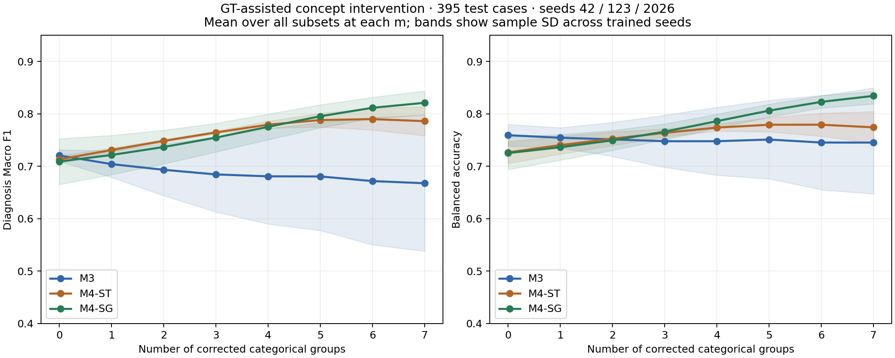
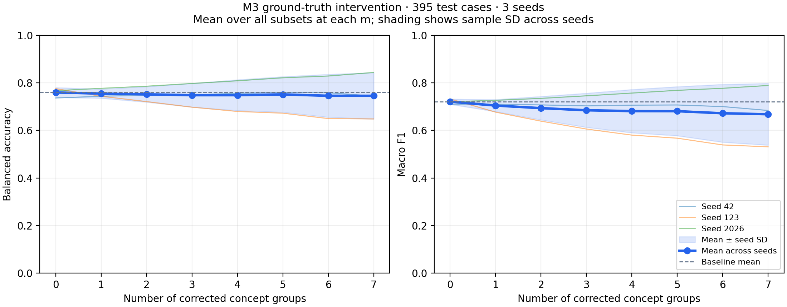
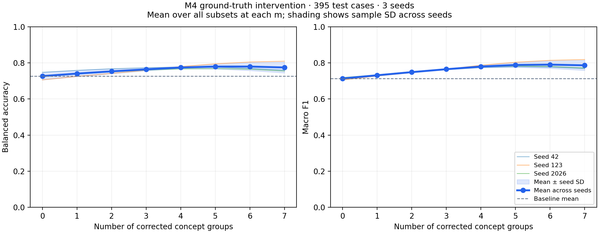
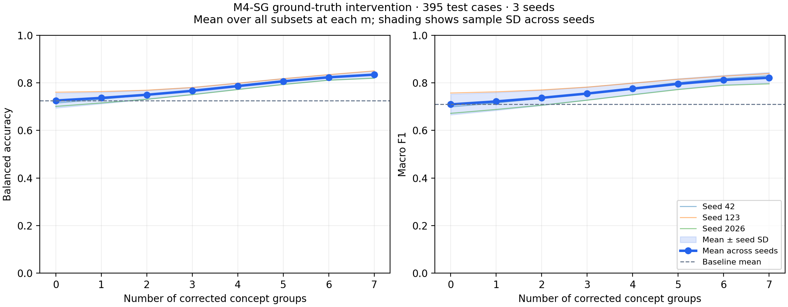
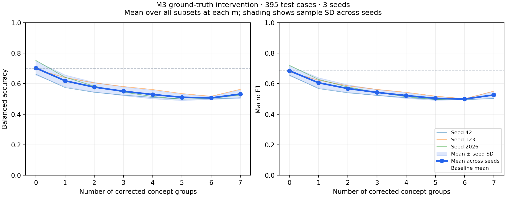
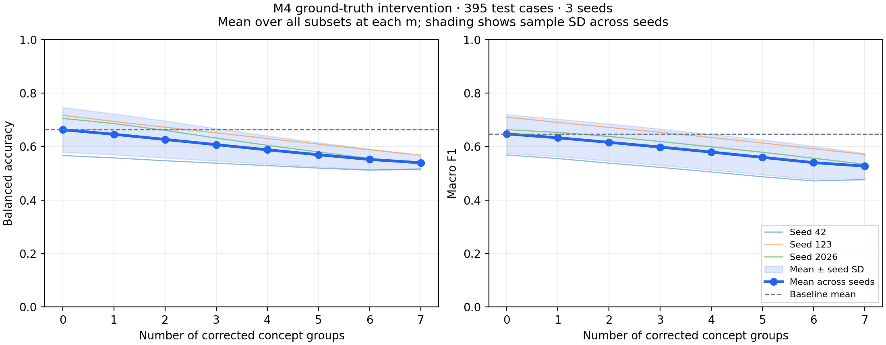

# Intervention M3, M4-ST và M4-SG MLP128 — 05/10/2026

Đây là báo cáo intervention chung. Bảng đầu dùng cohort F1 MLP128 20 epochs; các kết quả BAcc cũ nằm riêng cuối tài liệu. [Bảng test tự động chính](../README.md).

Đi tới: [M3 — phân tích](#m3-analysis), [M3 — curve](#m3-details), [ST — curve](#m4-st-details), [SG — curve](#m4-sg-details), [M3 BAcc cũ](#bacc-m3), [M4 BAcc cũ](#bacc-m4).

Đã hoàn tất cả ba cohorts cho seeds **42/123/2026**, mỗi seed **128 subsets × 395 ca test**. ST và SG là kết quả chạy bổ sung trong lượt này; M3 dùng nguyên kết quả đã kiểm tra trước đó.

Intervention thay toàn bộ categorical group được chọn bằng **GT concept one-hot của chính ca test đó**; không sửa annotation, không đưa GT diagnosis vào head. Diagnosis label chỉ dùng chấm điểm. Giữ head, weights và threshold validation; các groups chưa sửa giữ nguyên. M3 bắt đầu từ soft probabilities, ST/SG bắt đầu từ predicted one-hot.

**Đây là GT-assisted intervention, được trình bày riêng với automatic test.** Cùng MLP128, LRs/ngân sách nhưng runtime train ST 2.12 và M3/SG 2.14, cũng như representation/gradient, còn khác nhau; bảng chưa xác định hiệu quả riêng của từng yếu tố.

| Model | F1 tự động | F1 sửa đủ 7 groups | Delta mean F1 | BAcc tự động (%) | BAcc sửa đủ (%) |
|---|---:|---:|---:|---:|---:|
| M3 | 0.7207 ± 0.0110 | 0.6677 ± 0.1296 | -0.0530 | 75.94 ± 2.07 | 74.53 ± 9.76 |
| M4-ST | 0.7131 ± 0.0071 | 0.7862 ± 0.0279 | +0.0731 | 72.66 ± 2.09 | 77.44 ± 3.02 |
| M4-SG | 0.7091 ± 0.0437 | 0.8212 ± 0.0228 | +0.1121 | 72.53 ± 3.12 | 83.43 ± 1.52 |

Mỗi subset được chấm trên toàn bộ 395 ca; lấy mean qua tất cả subsets tại cùng m trong từng seed rồi lấy mean ± sample SD giữa seeds, ddof=1. SD này không phải bootstrap CI; chưa có kiểm định chênh lệch intervention giữa models. Không ensemble và không chọn subset tốt nhất trên test làm chính sách.

| Seed | M3: automatic → full GT F1 | ST: automatic → full GT F1 | SG: automatic → full GT F1 |
|---:|---:|---:|---:|
| 42 | 0.7100 → 0.6836 | 0.7164 → 0.7687 | 0.6986 → 0.8293 |
| 123 | 0.7320 → 0.5309 | 0.7050 → 0.8183 | 0.7570 → 0.8388 |
| 2026 | 0.7203 → 0.7886 | 0.7180 → 0.7715 | 0.6716 → 0.7955 |

| Số groups sửa | M3 mean F1 | ST mean F1 | SG mean F1 |
|---:|---:|---:|---:|
| 0 | 0.7207 | 0.7131 | 0.7091 |
| 1 | 0.7043 | 0.7311 | 0.7217 |
| 2 | 0.6934 | 0.7485 | 0.7368 |
| 3 | 0.6846 | 0.7647 | 0.7548 |
| 4 | 0.6809 | 0.7794 | 0.7753 |
| 5 | 0.6807 | 0.7882 | 0.7955 |
| 6 | 0.6719 | 0.7900 | 0.8117 |
| 7 | 0.6677 | 0.7862 | 0.8212 |

**Nhận xét đã đo được.**

- **ST:** full correction tăng F1 ở cả ba seeds. Mean Accuracy **77.05% → 84.47%**, AUC **0.8302 → 0.8986**. Sensitivity mean **63.70% → 63.04%**, specificity **81.63% → 91.84%**: gain chủ yếu gắn với giảm false positives, sensitivity không tăng nhất quán. Curve F1 đạt mean 0.7900 tại m=6 rồi còn 0.7862 tại m=7; không suy ra sửa thêm luôn tốt hơn và không chọn m=6 từ test.
- **SG:** full correction tăng F1 ở cả ba seeds, mean Accuracy **76.20% → 85.82%**, AUC **0.8001 → 0.9249**, sensitivity **65.02% → 78.55%**, specificity **80.05% → 88.32%**. Mean F1 curve tăng qua m=0…7. SG có full-intervention F1 cao nhất quan sát trong ba cohorts; đây không phải accuracy tự động cao nhất hoặc ưu thế đã kiểm định.
- **M3:** full F1 giảm ở seeds 42/123, tăng ở 2026; mean **0.7207 → 0.6677**. Giữ kết quả âm/không ổn định này làm Soft CBM reference. Soft → GT one-hot mismatch là giả thuyết, chưa phải nguyên nhân đã chứng minh.

**Correction vẫn có thể làm diagnosis đúng thành sai.** Full intervention ST có mean **55.33 ca tốt lên / 26.00 ca xấu đi**; SG **64.00 / 26.00**; M3 **54.33 / 83.00**. Ở cấp subset, ST có 1/0/1 subsets giảm F1 tại seeds 42/123/2026; SG có 1/6/0. Vì vậy gain trung bình không bảo đảm mọi case/subset đều hưởng lợi.

| Group sửa riêng | Delta mean F1 M3 | Delta mean F1 ST | Delta mean F1 SG |
|---|---:|---:|---:|
| pigment_network | -0.0252 | +0.0165 | +0.0207 |
| streaks | +0.0222 | +0.0246 | +0.0151 |
| pigmentation | -0.0148 | +0.0114 | +0.0064 |
| regression_structures | -0.0219 | +0.0112 | -0.0009 |
| dots_and_globules | -0.0475 | +0.0292 | +0.0287 |
| blue_whitish_veil | +0.0176 | +0.0163 | +0.0085 |
| vascular_structures | -0.0457 | +0.0170 | +0.0096 |

ST có delta single-group mean dương ở cả bảy groups; SG có `regression_structures` hơi âm (khoảng −0.0009). Đây là phân tích mô tả; không dùng bảng này để chọn lại intervention policy từ test. Strategy/granularity có thể thay đổi kết quả. [Shin et al., ICML 2023](https://proceedings.mlr.press/v202/shin23a.html).

Kết quả ủng hộ giữ ST/SG làm Hard CBM đối chứng về correction, nhưng chưa cô lập nguyên nhân chênh lệch soft/hard/gradient. Concept và task accuracy trước intervention không đủ xác định hiệu quả correction; predicted→GT input shift là vấn đề đã được nghiên cứu. [Koh et al., ICML 2020, §6](https://proceedings.mlr.press/v119/koh20a/koh20a.pdf).

M3/ST/SG không cập nhật groups chưa sửa. Điểm concept ở groups được nạp GT tăng không chứng minh lan truyền correction. Đây là mốc để M5 đánh giá độ đúng trên **groups chưa sửa**, diagnosis và latency.

**Đối chiếu đã hoàn tất.** CPU head replay độc lập tái tạo đúng scores/predictions của **768 subsets mới / 303.360 case-subset pairs**, sai lệch score tối đa 0 trong lượt audit này. Kiểm tra official GT, one-hot/group replacement, frozen baseline, no-op cases, remaining groups, metrics, case transitions, curve aggregation và provenance. **147 artifacts cũ** gồm source JSON, metadata và BAcc/new-cohort checkpoints giữ nguyên SHA-256.

[M3 analysis](#m3-analysis) · [ST report](#m4-st-details) · [SG report](#m4-sg-details) · [SVG](intervention_models_comparison.svg).

**Bước tiếp theo:** baseline diagnosis/concept/intervention M0–M4 đã đủ để chuyển sang prototype M5 categorical ECBM. Giữ các kết quả và hạn chế hiện tại; không train lại để đạt thứ hạng định trước.

## Bảng chi tiết và kết quả đối chiếu

Các bảng bổ sung giữ SD giữa seeds, chuyển trạng thái diagnosis và số ca theo subset. Bộ BAcc cũ được trình bày riêng để đối chiếu.

### M3 MLP128 — phân tích từng seed và từng group

Mở bảng và ghi nhận chi tiết

Intervention ST/SG tương ứng hiện đã hoàn tất và nằm trong bảng chung phía trên; hướng nghiên cứu tiếp theo là M5.

Intervention đã hoàn tất: **128 subsets × 395 ca × ba seeds 42/123/2026**. Mean Macro F1 giảm khi thay thêm nhóm concept bằng annotation one-hot; kết quả giữa seeds khác nhau rõ. Giữ cohort này làm Soft CBM baseline, đồng thời báo cáo khả năng hưởng lợi từ intervention chưa ổn định dưới protocol hiện tại.

[Báo cáo tự sinh và đường intervention](#m3-details) · [Summary](m3/mlp128_e20_headlr0.001/intervention/summary.json) · [Tác động từng group](m3/mlp128_e20_headlr0.001/intervention/per_concept.csv) · [Ca tốt lên/xấu đi khi sửa đủ bảy groups](m3/mlp128_e20_headlr0.001/intervention/full_intervention_cases.csv) · [Train/validation/test của cohort](all_models_comparison.md#m3-report)

#### Baseline và sửa đủ bảy groups

| Chỉ số, mean ± sample SD giữa seeds | M3 test gốc, m=0 | GT intervention, m=7 |
|---|---:|---:|
| Accuracy (%) | 75.95 ± 0.67 | 68.69 ± 14.21 |
| Balanced Accuracy (%) | 75.94 ± 2.07 | 74.53 ± 9.76 |
| Macro F1 | 0.7207 ± 0.0110 | 0.6677 ± 0.1296 |

Mean delta Macro F1 **-0.0530**, sample SD của paired deltas **0.1367**; mean delta BAcc **-1.41 điểm %**, sample SD của paired deltas **10.37 điểm %**. SD của điểm sau intervention và SD của delta là hai thống kê khác nhau; cả hai đều không phải confidence interval hoặc kiểm định ý nghĩa thống kê.

| Seed | F1 trước | F1 sau | Delta F1 | BAcc trước (%) | BAcc sau (%) | Sai → đúng | Đúng → sai |
|---:|---:|---:|---:|---:|---:|---:|---:|
| 42 | 0.7100 | 0.6836 | -0.0263 | 73.60 | 74.44 | 50 | 68 |
| 123 | 0.7320 | 0.5309 | -0.2011 | 77.53 | 64.81 | 41 | 133 |
| 2026 | 0.7203 | 0.7886 | +0.0683 | 76.68 | 84.34 | 72 | 48 |

Seed 42 có BAcc tăng nhẹ nhưng F1 giảm; seed 123 giảm mạnh ở cả hai metrics; seed 2026 tăng. Không mô tả mọi seed đều xấu đi hoặc mọi concept correction đều có hại. Trung bình sửa đủ bảy groups làm **54.33 ca sai → đúng** và **83.00 ca đúng → sai** mỗi seed; net **-28.67 ca đúng**. Giữ cả ba seeds, không chọn riêng seed 2026 theo điểm intervention.

Mean sensitivity tăng **75.91% → 86.47%**, specificity giảm **75.96% → 62.59%**. Mean AUC gần giữ nguyên (**0.8490 → 0.8478**), nhưng mean che khuất biến động giữa seeds.

Với seed 123, FP tăng **71 → 172**, FN giảm **21 → 12**; specificity **75.85% → 41.50%**. Số ca được dự đoán melanoma tăng **151 → 261**; median probability tăng **0.1532 → 0.3452** tại threshold giữ nguyên **0.259394**. AUC cũng giảm **0.8622 → 0.7900**, nên kết quả không chỉ là sự thay đổi nhãn do dùng một threshold cố định. Không tối ưu lại threshold trên test để sửa kết quả này.

#### Sửa riêng từng group

| Group | Mean delta BAcc (điểm %) | Mean delta Macro F1 |
|---|---:|---:|
| pigment_network | -1.39 | -0.0252 |
| streaks | +1.70 | +0.0222 |
| pigmentation | +0.68 | -0.0148 |
| regression_structures | -0.84 | -0.0219 |
| dots_and_globules | -1.44 | -0.0475 |
| blue_whitish_veil | -0.14 | +0.0176 |
| vascular_structures | -1.96 | -0.0457 |

Các deltas là tác động sửa riêng một group trên frozen model, có thể khác dấu giữa BAcc và F1. Chúng không đo tầm quan trọng tổng quát, quan hệ nhân quả y khoa hoặc hiệu quả của một chính sách chọn group trên người dùng thực tế. Với m=1…6, curve lấy mean metric qua tất cả subsets cùng m trên toàn bộ test, rồi tổng hợp mean/sample SD giữa seeds.

#### Diễn giải cho khóa luận

M3 mới đã cải thiện diagnosis so với Linear cũ, nhưng correction theo GT one-hot chưa đem lại lợi ích ổn định. Diagnosis F1 tốt hơn không tự chứng minh head sử dụng concept theo cách dễ hiệu chỉnh.

M3 head được train trên soft probability vectors; intervention thay toàn bộ block được chọn bằng one-hot, kể cả khi argmax của block đã đúng. Vì vậy thí nghiệm thay cả trạng thái dự đoán lẫn mức độ mềm của đầu vào. Sự khác biệt representation/distribution và cách head học từ predicted concepts là các giả thuyết cần khảo sát; các số này chưa xác lập nguyên nhân. Nghiên cứu CBM gốc cũng bàn về khác biệt phân bố giữa predicted và true concepts trong intervention. [Koh et al., ICML 2020, mục 6](https://proceedings.mlr.press/v119/koh20a/koh20a.pdf).

Ở m=7, GT concept vectors của cùng ca giống nhau giữa ba seeds, còn diagnosis heads và thresholds đã học khác nhau. Biến động output giữa seeds ở mức này phản ánh các thành phần đó, không phải việc đọc ba bộ annotation khác nhau. Chưa có bằng chứng từ thí nghiệm này để khẳng định concept leakage, annotation sai, inconsistency là nguyên nhân hoặc ECBM chắc chắn tốt hơn.

Intervention dùng thêm annotation concept của ca test, mô phỏng chuyên gia cung cấp thông tin đúng; nhãn diagnosis chỉ dùng để chấm điểm. Báo cáo intervention riêng với test tự động **0.7207 ± 0.0110**. M2 oracle được train riêng trên GT concepts nên không đồng nhất với M3 khi sửa đủ bảy groups.

Giữ weights, epochs, thresholds và baseline hiện tại. Bước so sánh tiếp theo là intervention của M4-SG MLP128 cùng cohort head/LRs/ngân sách, M4-ST cấu hình tương ứng và M5 categorical ECBM. Mọi thay đổi protocol/head/threshold trong nghiên cứu sau cần được chọn bằng train/validation trước khi đánh giá; không sửa cohort này theo điểm test/intervention đã xem.

#### Đối chiếu kết quả

- Official IDs/nhãn của 395 ca và concept targets lấy theo manifest/schema đã đóng băng.
- Hash checkpoint, epochs **19/7/18**, configs và thresholds khớp quyết định chốt trước test.
- Baseline m=0 khớp frozen test exports cả predictions và metrics.
- Tái tạo **toàn bộ 384 subsets** từ checkpoint head và GT concept targets trên CPU: probabilities khớp đúng các exports trong lượt replay này (max absolute error **0.0**), labels khớp hoàn toàn.
- Summarizer tính lại metrics, ca tốt lên/xấu đi, curves và seed statistics từ predictions; summary tái tính khớp bản đã lưu.
- Biểu đồ được kiểm tra trực quan; measurements và frozen test exports được giữ nguyên khi cập nhật tài liệu.

### M3 MLP128 — bảng curve và ca tốt lên/xấu đi

Mở bảng và ghi nhận chi tiết

Seeds: [42, 123, 2026]; 395 ca test; 128 subsets cho mỗi seed.

Thay toàn bộ group được sửa bằng ground-truth one-hot. Giữ nguyên các groups chưa sửa, diagnosis head và threshold validation của từng seed; không huấn luyện lại.

Metrics được tính riêng cho mỗi subset trên toàn bộ test, rồi lấy trung bình theo m, sau đó tổng hợp mean ± sample SD giữa seeds. SD này không phải khoảng tin cậy theo mẫu.

| Số groups sửa | Balanced Accuracy (%) | Macro-F1 | Ca tốt lên (TB) | Ca xấu đi (TB) |
|---|---:|---:|---:|---:|
| 0 | 75.94 ± 2.07 | 0.7207 ± 0.0110 | 0.00 | 0.00 |
| 1 | 75.45 ± 1.92 | 0.7043 ± 0.0253 | 23.24 | 31.90 |
| 2 | 75.14 ± 3.25 | 0.6934 ± 0.0493 | 32.57 | 46.97 |
| 3 | 74.79 ± 4.98 | 0.6846 ± 0.0716 | 38.56 | 57.30 |
| 4 | 74.79 ± 6.48 | 0.6809 ± 0.0909 | 43.67 | 64.58 |
| 5 | 75.11 ± 7.48 | 0.6807 ± 0.1031 | 47.44 | 69.24 |
| 6 | 74.54 ± 9.01 | 0.6719 ± 0.1215 | 50.81 | 76.95 |
| 7 | 74.53 ± 9.76 | 0.6677 ± 0.1296 | 54.33 | 83.00 |

Ca tốt lên/xấu đi được so với m=0 của cùng seed; ở m=1…6 là trung bình qua subsets và seeds, không phải số ca duy nhất. Ở m=7, mỗi seed có một subset sửa đủ bảy groups.

| Sửa toàn bộ 7 groups | Balanced Accuracy (%) | Macro-F1 | Tốt lên | Xấu đi |
|---|---:|---:|---:|---:|
| Seed 42 | 74.44 | 0.6836 | 50 | 68 |
| Seed 123 | 64.81 | 0.5309 | 41 | 133 |
| Seed 2026 | 84.34 | 0.7886 | 72 | 48 |

Sửa đủ bảy groups làm Balanced Accuracy trung bình thay đổi -1.41 điểm phần trăm (75.94% → 74.53%). Đây là kết quả mô tả trên các checkpoints hiện có.

Diagnosis head M3 được học từ soft probabilities; khi intervention, input của head chuyển sang ground-truth one-hot ở các groups được sửa. Sự khác biệt representation là một giả thuyết cần khảo sát để giải thích kết quả, chưa được xác lập là nguyên nhân. Các số liệu này chưa tự chứng minh concept leakage, ảnh hưởng của inconsistency hoặc ưu thế của ECBM.

Các file đi kèm: `m3/mlp128_e20_headlr0.001/intervention/summary.json`, `m3/mlp128_e20_headlr0.001/intervention/curve.csv`, `m3/mlp128_e20_headlr0.001/intervention/per_concept.csv`, `m3/mlp128_e20_headlr0.001/intervention/full_intervention_cases.csv` và JSON chi tiết cho từng seed.

`m3/mlp128_e20_headlr0.001/intervention/per_concept.csv` đo tác động sửa riêng từng group, không đo tầm quan trọng tổng quát hoặc quan hệ nhân quả. Với M3, groups chưa sửa giữ nguyên dự đoán nên accuracy của chúng không thay đổi khi giữ cùng group. Trung bình qua các group còn lại có thể thay đổi theo subset; tại m=7 chỉ số này không áp dụng.

Đây là mô phỏng hiệu chỉnh annotation. Kết quả sửa toàn bộ concepts dùng diagnosis head M3 đã học và không đồng nhất với oracle classifier M2 được huấn luyện riêng.

### M4-ST MLP128 — bảng curve và ca tốt lên/xấu đi

Mở bảng và ghi nhận chi tiết

| Số groups sửa | Balanced Accuracy (%) | Macro-F1 | Ca tốt lên (TB) | Ca xấu đi (TB) |
|---|---:|---:|---:|---:|
| 0 | 72.66 ± 2.09 | 0.7131 ± 0.0071 | 0.00 | 0.00 |
| 1 | 74.04 ± 1.69 | 0.7311 ± 0.0037 | 10.76 | 3.67 |
| 2 | 75.28 ± 1.31 | 0.7485 ± 0.0028 | 20.86 | 6.94 |
| 3 | 76.38 ± 0.79 | 0.7647 ± 0.0024 | 30.38 | 10.19 |
| 4 | 77.39 ± 0.67 | 0.7794 ± 0.0066 | 39.41 | 13.70 |
| 5 | 77.93 ± 1.35 | 0.7882 ± 0.0131 | 46.70 | 17.57 |
| 6 | 77.94 ± 2.20 | 0.7900 ± 0.0207 | 51.86 | 21.76 |
| 7 | 77.44 ± 3.02 | 0.7862 ± 0.0279 | 55.33 | 26.00 |

| Sửa toàn bộ 7 groups | Balanced Accuracy (%) | Macro-F1 | Tốt lên | Xấu đi |
|---|---:|---:|---:|---:|
| Seed 42 | 75.93 | 0.7687 | 59 | 31 |
| Seed 123 | 80.91 | 0.8183 | 52 | 16 |
| Seed 2026 | 75.47 | 0.7715 | 55 | 31 |

Sửa đủ bảy groups làm Balanced Accuracy trung bình thay đổi +4.77 điểm phần trăm (72.66% → 77.44%). Đây là kết quả mô tả trên các checkpoints hiện có.

Diagnosis head M4 được học từ predicted one-hot concepts và nhận ground-truth one-hot khi intervention. Hai đầu vào cùng dạng rời rạc, nhưng phân bố tổ hợp concept dự đoán và concept GT vẫn có thể khác nhau. Cùng representation không bảo đảm hiệu chỉnh có lợi. Kết quả chưa tự xác lập nguyên nhân của chênh lệch M3–M4, ảnh hưởng của inconsistency hoặc ưu thế của ECBM.

Các file đi kèm: `m4_st/mlp128_e20_headlr0.001/intervention/summary.json`, `m4_st/mlp128_e20_headlr0.001/intervention/curve.csv`, `m4_st/mlp128_e20_headlr0.001/intervention/per_concept.csv`, `m4_st/mlp128_e20_headlr0.001/intervention/full_intervention_cases.csv` và JSON chi tiết cho từng seed.

`m4_st/mlp128_e20_headlr0.001/intervention/per_concept.csv` đo tác động sửa riêng từng group, không đo tầm quan trọng tổng quát hoặc quan hệ nhân quả. Với M4, groups chưa sửa giữ nguyên dự đoán nên accuracy của chúng không thay đổi khi giữ cùng group. Trung bình qua các group còn lại có thể thay đổi theo subset; tại m=7 chỉ số này không áp dụng.

Đây là mô phỏng hiệu chỉnh annotation. Kết quả sửa toàn bộ concepts dùng diagnosis head M4 đã học và không đồng nhất với oracle classifier M2 được huấn luyện riêng.

### M4-SG MLP128 — bảng curve và ca tốt lên/xấu đi

Mở bảng và ghi nhận chi tiết

| Số groups sửa | Balanced Accuracy (%) | Macro-F1 | Ca tốt lên (TB) | Ca xấu đi (TB) |
|---|---:|---:|---:|---:|
| 0 | 72.53 ± 3.12 | 0.7091 ± 0.0437 | 0.00 | 0.00 |
| 1 | 73.64 ± 2.45 | 0.7217 ± 0.0375 | 9.19 | 4.33 |
| 2 | 74.96 ± 1.90 | 0.7368 ± 0.0320 | 18.44 | 7.87 |
| 3 | 76.62 ± 1.51 | 0.7548 ± 0.0274 | 28.04 | 11.17 |
| 4 | 78.62 ± 1.35 | 0.7753 ± 0.0245 | 38.31 | 14.60 |
| 5 | 80.63 ± 1.23 | 0.7955 ± 0.0220 | 48.60 | 18.35 |
| 6 | 82.30 ± 1.17 | 0.8117 ± 0.0200 | 57.67 | 22.33 |
| 7 | 83.43 ± 1.52 | 0.8212 ± 0.0228 | 64.00 | 26.00 |

| Sửa toàn bộ 7 groups | Balanced Accuracy (%) | Macro-F1 | Tốt lên | Xấu đi |
|---|---:|---:|---:|---:|
| Seed 42 | 83.36 | 0.8293 | 66 | 21 |
| Seed 123 | 85.00 | 0.8388 | 52 | 28 |
| Seed 2026 | 81.95 | 0.7955 | 74 | 29 |

Sửa đủ bảy groups làm Balanced Accuracy trung bình thay đổi +10.90 điểm phần trăm (72.53% → 83.43%). Đây là kết quả mô tả trên các checkpoints hiện có.

Diagnosis head M4-SG được học từ predicted one-hot concepts và nhận ground-truth one-hot khi intervention. Hai đầu vào cùng dạng rời rạc, nhưng phân bố tổ hợp concept dự đoán và concept GT vẫn có thể khác nhau. Cùng representation không bảo đảm hiệu chỉnh có lợi. Kết quả chưa tự xác lập nguyên nhân của chênh lệch M3–M4, ảnh hưởng của inconsistency hoặc ưu thế của ECBM. Khi huấn luyện M4-SG, gradient của loss chẩn đoán dừng tại bottleneck; concept heads và backbone được cập nhật bằng concept loss.

Các file đi kèm: `m4_sg/mlp128_e20_headlr0.001/intervention/summary.json`, `m4_sg/mlp128_e20_headlr0.001/intervention/curve.csv`, `m4_sg/mlp128_e20_headlr0.001/intervention/per_concept.csv`, `m4_sg/mlp128_e20_headlr0.001/intervention/full_intervention_cases.csv` và JSON chi tiết cho từng seed.

`m4_sg/mlp128_e20_headlr0.001/intervention/per_concept.csv` đo tác động sửa riêng từng group, không đo tầm quan trọng tổng quát hoặc quan hệ nhân quả. Với M4-SG, groups chưa sửa giữ nguyên dự đoán nên accuracy của chúng không thay đổi khi giữ cùng group. Trung bình qua các group còn lại có thể thay đổi theo subset; tại m=7 chỉ số này không áp dụng.

Đây là mô phỏng hiệu chỉnh annotation. Kết quả sửa toàn bộ concepts dùng diagnosis head M4-SG đã học và không đồng nhất với oracle classifier M2 được huấn luyện riêng.

### M3 BAcc cũ — intervention lưu trữ

Mở bảng và ghi nhận chi tiết

Ghi nhận ở thời điểm của thí nghiệm cũ hoặc pilot trước test. Các câu về bước tiếp theo mô tả thời điểm đó; trạng thái hiện tại nằm ở bảng chính phía trên.

| Số groups sửa | Balanced Accuracy (%) |         Macro-F1 | Ca tốt lên (TB) | Ca xấu đi (TB) |
| --------------- | --------------------: | ---------------: | ----------------: | ---------------: |
| 0               |         70.30 ± 4.58 | 0.6844 ± 0.0326 |              0.00 |             0.00 |
| 1               |         61.89 ± 3.85 | 0.6057 ± 0.0333 |             34.52 |            58.24 |
| 2               |         57.74 ± 3.13 | 0.5680 ± 0.0246 |             44.62 |            78.75 |
| 3               |         55.03 ± 2.85 | 0.5426 ± 0.0195 |             48.79 |            90.16 |
| 4               |         52.90 ± 2.82 | 0.5220 ± 0.0187 |             51.15 |            97.74 |
| 5               |         51.09 ± 2.09 | 0.5037 ± 0.0127 |             52.08 |           102.30 |
| 6               |         50.66 ± 0.95 | 0.4995 ± 0.0036 |             53.95 |           103.48 |
| 7               |         53.19 ± 2.83 | 0.5262 ± 0.0243 |             59.67 |            94.67 |

| Sửa toàn bộ 7 groups | Balanced Accuracy (%) | Macro-F1 | Tốt lên | Xấu đi |
| ----------------------- | --------------------: | -------: | --------: | -------: |
| Seed 42                 |                 50.75 |   0.5026 |        58 |       82 |
| Seed 123                |                 56.29 |   0.5511 |        56 |      101 |
| Seed 2026               |                 52.54 |   0.5248 |        65 |      101 |

Sửa đủ bảy groups làm Balanced Accuracy trung bình thay đổi -17.11 điểm phần trăm (70.30% → 53.19%). Đây là kết quả mô tả trên các checkpoints hiện có.

Các file đi kèm: `../bacc/m3/linear_e10/intervention/summary.json`, `../bacc/m3/linear_e10/intervention/curve.csv`, `../bacc/m3/linear_e10/intervention/per_concept.csv`, `../bacc/m3/linear_e10/intervention/full_intervention_cases.csv` và JSON chi tiết cho từng seed.

`../bacc/m3/linear_e10/intervention/per_concept.csv` đo tác động sửa riêng từng group, không đo tầm quan trọng tổng quát hoặc quan hệ nhân quả. Với M3, groups chưa sửa giữ nguyên dự đoán nên accuracy của chúng không thay đổi khi giữ cùng group. Trung bình qua các group còn lại có thể thay đổi theo subset; tại m=7 chỉ số này không áp dụng.

### M4-ST BAcc cũ — intervention lưu trữ

Mở bảng và ghi nhận chi tiết

Ghi nhận ở thời điểm của thí nghiệm cũ hoặc pilot trước test. Các câu về bước tiếp theo mô tả thời điểm đó; trạng thái hiện tại nằm ở bảng chính phía trên.

JSON intervention BAcc seed 2026 lưu hash của checkpoint cũ khác weights hiện tại. Giữ nguyên kết quả và hash để bảo toàn nguồn gốc; không đồng nhất với cohort F1 MLP128.

| Số groups sửa | Balanced Accuracy (%) | Macro-F1 | Ca tốt lên (TB) | Ca xấu đi (TB) |
|---|---:|---:|---:|---:|
| 0 | 66.28 ± 8.38 | 0.6471 ± 0.0722 | 0.00 | 0.00 |
| 1 | 64.58 ± 7.65 | 0.6326 ± 0.0698 | 13.10 | 14.62 |
| 2 | 62.65 ± 6.93 | 0.6156 ± 0.0695 | 23.29 | 26.83 |
| 3 | 60.69 ± 6.07 | 0.5979 ± 0.0679 | 31.89 | 37.28 |
| 4 | 58.77 ± 5.28 | 0.5791 ± 0.0667 | 39.29 | 46.41 |
| 5 | 56.92 ± 4.58 | 0.5595 ± 0.0653 | 45.44 | 54.54 |
| 6 | 55.17 ± 3.85 | 0.5397 ± 0.0620 | 50.43 | 61.86 |
| 7 | 53.93 ± 2.65 | 0.5267 ± 0.0476 | 55.00 | 68.33 |

| Sửa toàn bộ 7 groups | Balanced Accuracy (%) | Macro-F1 | Tốt lên | Xấu đi |
|---|---:|---:|---:|---:|
| Seed 42 | 51.61 | 0.4759 | 33 | 30 |
| Seed 123 | 56.81 | 0.5704 | 55 | 89 |
| Seed 2026 | 53.38 | 0.5339 | 77 | 86 |

Sửa đủ bảy groups làm Balanced Accuracy trung bình thay đổi -12.34 điểm phần trăm (66.28% → 53.93%). Đây là kết quả mô tả trên các checkpoints hiện có.

Các file đi kèm: `../bacc/m4_st/linear_e10/intervention/summary.json`, `../bacc/m4_st/linear_e10/intervention/curve.csv`, `../bacc/m4_st/linear_e10/intervention/per_concept.csv`, `../bacc/m4_st/linear_e10/intervention/full_intervention_cases.csv` và JSON chi tiết cho từng seed.

`../bacc/m4_st/linear_e10/intervention/per_concept.csv` đo tác động sửa riêng từng group, không đo tầm quan trọng tổng quát hoặc quan hệ nhân quả. Với M4, groups chưa sửa giữ nguyên dự đoán nên accuracy của chúng không thay đổi khi giữ cùng group. Trung bình qua các group còn lại có thể thay đổi theo subset; tại m=7 chỉ số này không áp dụng.

